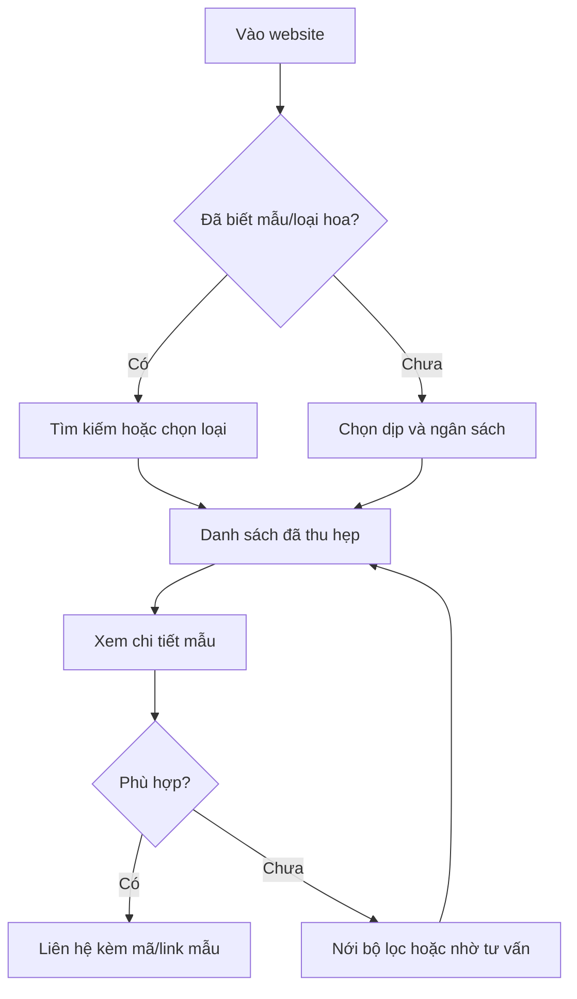
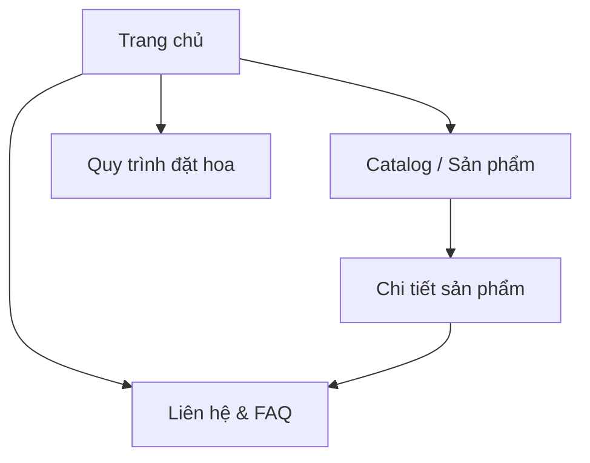

# Báo cáo phân tích BA và đề xuất UI/UX website Lamie

> Giai đoạn: Khảo sát nghiệp vụ và định hướng thiết kế — chưa phát triển  
> Thời điểm phân tích: 20–22/09/2026  
> Trạng thái: Mọi lựa chọn định hướng BA/UI/UX đã được xác nhận — chưa chuyển sang thiết kế chi tiết hoặc phát triển  
> Phạm vi: Website tĩnh giới thiệu thương hiệu, catalog sản phẩm và dẫn khách đến kênh liên hệ

## 1. Executive summary

Lamie không cần một website thương mại điện tử giả lập. Website nên là một **showroom số có khả năng tìm mẫu tốt**, giúp khách đi từ cảm xúc thương hiệu đến một mẫu hoa phù hợp, hiểu điều kiện đặt hoa, rồi liên hệ Lamie với đủ ngữ cảnh để được xác nhận.

Các kết luận chính:

1. **Nền tảng hiện tại có phần catalog đáng giữ**: tải dữ liệu tĩnh, tìm kiếm không dấu, lọc OR trong nhóm/AND giữa nhóm, trạng thái loading/error/empty, gallery ảnh, responsive và nhiều xử lý accessibility đã được mô tả khá tốt.
2. **Các chức năng mô phỏng đang làm giảm độ tin cậy**: đăng nhập nhận mọi tài khoản, dashboard thành viên hard-code, badge giỏ hàng cố định, Add to cart không tạo giỏ, chat bot giả, form liên hệ không gửi, link footer không hoạt động. Trong phạm vi website tĩnh, các phần này nên bị loại bỏ hoặc thay bằng CTA liên hệ thật.
3. **Rủi ro lớn nhất không phải giao diện mà là tính đúng của nội dung**: tài liệu hiện trạng ghi nhận 16 sản phẩm nhưng còn dữ liệu test, trong khi quy mô mục tiêu đã được xác nhận là trên 60 sản phẩm và hiện chưa có file dữ liệu thật. Tên khu vực catalog được chốt là **“Mẫu hoa Lamie”**; mỗi card có trạng thái riêng và mọi đơn đều cần Lamie xác nhận.
4. **Cấu trúc đã chọn là mô hình kết hợp**: trang chủ kể câu chuyện Lamie; Catalog có URL riêng để tìm/lọc; mỗi sản phẩm có URL riêng để chia sẻ; desktop có quick view và mobile mở thẳng trang chi tiết.
5. **Định hướng hình ảnh đã chọn là bản phối có kiểm soát**: Botanical Paper Editorial làm nền; Contemporary Floral Gallery cho catalog; Immersive Bloom dùng chọn lọc. Tính cách bổ sung là hiện đại và tối giản nhẹ, tránh vintage nặng hoặc trang trí lấn át sản phẩm.
6. **Motion đã chọn là Balanced có điểm nhấn Immersive**: hero dùng 2.5D nhiều lớp; quy trình dùng dải ruy băng dẫn chuyện và chỉ có một điểm nhấn 3D thực ở cảnh bó hoa hoàn thiện; mobile giản lược và reduced motion dùng bố cục tĩnh đầy đủ.
7. Với quy mô dự kiến trên 60 sản phẩm, **sidebar từ 1024 px trở lên và bottom sheet dưới 1024 px** đã được chọn. Bốn nhóm ưu tiên là Dịp, Ngân sách, Dòng hoa và Kiểu dáng.
8. **Chuyển đổi chính là “Liên hệ đặt hoa” qua bảng chọn kênh** gồm Instagram, TikTok, hotline, Zalo và Facebook; các kênh được trình bày ngang nhau. Website tạo bản tóm tắt tùy chọn để khách sao chép hoặc điền sẵn khi nền tảng hỗ trợ.
9. **Ngôn ngữ đã chọn là tiếng Việt**. Hoa tươi chỉ công bố “Liên hệ Lamie để kiểm tra khu vực giao”; Hoa sáp & lụa giao toàn quốc. Phí giao và thời gian chuẩn bị đều do Lamie xác nhận.
10. **Nguyên tắc xử lý phần còn lại đã được chốt:** áp dụng phương án BA/UI/UX đề xuất làm mặc định; riêng dữ liệu kinh doanh, hình ảnh, chính sách và liên kết chưa tồn tại vẫn phải đánh dấu TBD/ẩn, không được tự tạo.

### Tài liệu và bằng chứng đã sử dụng

| Nguồn | Trạng thái sử dụng | Lưu ý |
| --- | --- | --- |
| `MO_TA_FE_HIEN_TAI(1).md` | Đã đọc toàn bộ | Là nguồn chính cho audit hiện trạng source, dữ liệu và chức năng. |
| `1(1).png` | Đã kiểm tra | Concept nền giấy kem, texture nhẹ, lá ép khô, logotype serif nâu. |
| `1(2).png` | Đã kiểm tra | Trùng hoàn toàn với `1(1).png` theo nội dung tệp. |
| Thư mục `FE_Lamie` | **Không đủ dữ liệu** | Không hiện diện trong workspace của phiên này; không thể kiểm chứng trực tiếp code. Mọi nhận định cấp source dựa trên tài liệu hiện trạng. |
| Dữ liệu `products.json`, `manifest.json`, ảnh sản phẩm | **Không đủ dữ liệu** | Không hiện diện; chỉ dùng snapshot thống kê trong tài liệu hiện trạng. |
| `README.md` của Impeccable | Đã đọc toàn bộ | Áp dụng nguyên tắc shape/critique, phân cấp, purposeful motion, responsive và accessibility. Không chạy audit vì source không có và giai đoạn này cấm chỉnh code. |
| `DESIGN.md` tìm thấy cùng bộ Impeccable | Đã đọc toàn bộ nhưng không dùng token | Đây là design system “Neo Kinpaku” của Impeccable, không phải design system Lamie; màu đen–vàng và typography của tài liệu này không được áp vào Lamie. |

### Quy ước độ chắc chắn

- **TBD – Cần xác nhận**: chủ shop phải quyết định hoặc cung cấp dữ liệu.
- **Giả định tạm thời**: được dùng để có thể mô tả luồng/thiết kế, nhưng chưa phải yêu cầu đã duyệt.
- **Không đủ dữ liệu**: chưa thể kết luận hợp lệ từ nguồn hiện có.

---

## 2. Phân tích hiện trạng

### 2.1 Website hiện đang phục vụ mục tiêu nào?

Theo tài liệu hiện trạng, frontend hiện là một prototype kết hợp ba mục tiêu:

- Landing page giới thiệu Lamie và tạo cảm xúc thương hiệu.
- Catalog tĩnh để tìm, lọc và xem chi tiết 16 sản phẩm.
- Mô phỏng một website thương mại điện tử có tài khoản, thành viên, chat và giỏ hàng, dù các luồng này chưa có backend và không hoàn thành giao dịch.

Hai mục tiêu đầu phù hợp với phạm vi mới. Mục tiêu thứ ba không phù hợp vì tạo kỳ vọng sai rằng khách có thể đăng nhập, thêm giỏ, gửi form hoặc chat thật.

### 2.2 Bảng audit hiện trạng

| Hạng mục | Hiện trạng | Vấn đề | Đề xuất | Mức ưu tiên |
| --- | --- | --- | --- | --- |
| Định vị tổng thể | Landing thương hiệu + catalog + mô phỏng e-commerce | Mục tiêu bị chia nhỏ; khách khó biết website là nơi xem mẫu hay mua trực tiếp | Định vị lại thành showroom số: khám phá → xem chi tiết → liên hệ đặt hoa | P0 |
| Header | Logo, Home, Shop, túi hàng, Sign in, menu mobile | Túi có badge `2` cố định; Sign in dẫn vào auth giả | Giữ logo/nav; thay túi và Sign in bằng “Xem mẫu” và CTA “Tư vấn đặt hoa” | P0 |
| Hero | Có định vị, CTA Shop, CTA About; ảnh Picsum | Ảnh không thuộc Lamie; CTA About chưa hoạt động; thông điệp chưa được xác nhận | Dùng ảnh/video thật; một CTA khám phá và một CTA tư vấn có chức năng rõ | P0 |
| Câu chuyện Lamie | Có section và copy giới thiệu | Ảnh từ nguồn ngoài; câu chuyện chưa được chủ shop duyệt | Viết lại từ câu chuyện thật; chỉ xuất bản nội dung đã xác nhận | P1 |
| Bộ sưu tập trang chủ | Hiển thị 4 sản phẩm; có loading/error/empty | Lấy “4 sản phẩm đầu” không phản ánh nổi bật hay có sẵn | Có cờ `featured` hoặc danh sách chọn tay; không suy ra từ thứ tự dữ liệu | P1 |
| Gallery/marquee | Ảnh chạy ngang liên tục | Ảnh Picsum; chuyển động liên tục có thể gây phân tán và tốn dữ liệu | Dùng ảnh Lamie; cho phép pause; tắt chuyển động khi reduced motion | P2 |
| Lý do chọn Lamie | Ba cam kết được hiển thị | “Hoa tươi mỗi ngày”, “giao nhanh toàn TP.HCM” cần bằng chứng/chính sách | Chỉ giữ cam kết đã xác nhận; không dùng claim tuyệt đối nếu không bảo đảm | P1 |
| Form liên hệ | Nhập tên, điện thoại, lời nhắn | Submit không gửi/lưu; dễ làm khách tưởng yêu cầu đã được tiếp nhận | Loại bỏ trong giai đoạn tĩnh hoặc nối đến kênh thật sau khi xác nhận | P0 |
| Chat | Nút nổi, phản hồi tự động sau 800 ms | Không có người thật/API; phản hồi giả làm giảm niềm tin | Thay bằng CTA tư vấn mở kênh đã xác nhận; không giả lập hội thoại | P0 |
| Catalog | Có search, đa bộ lọc, giá min/max | Taxonomy chưa chuẩn; có tag/collection trùng nghĩa; dữ liệu test lọt ra | Chuẩn hóa taxonomy; giảm nhóm lọc; làm sạch dữ liệu trước khi xuất bản | P0 |
| Logic lọc | OR trong nhóm, AND giữa nhóm; dùng giá hiện tại nếu có khuyến mãi | Cần loại sản phẩm báo giá khỏi khoảng số và xử lý seasonal | Giữ logic; bổ sung chế độ hiển thị giá, trạng thái và chip “Liên hệ báo giá” | P0 |
| Sidebar/bottom sheet | Sidebar desktop; bottom sheet mobile; có chip | Hiện trạng cần chuẩn hóa hierarchy và breakpoint | Giữ sidebar từ 1024 px; dùng bottom sheet dưới 1024 px, có count/Apply/Clear | P0 |
| Product card | Hiển thị sản phẩm trong grid | Chưa rõ ưu tiên thông tin; dữ liệu test/giá giả làm giảm tin cậy | Card: ảnh, tên, mã, giá hoặc “Liên hệ báo giá”, trạng thái, dòng/kiểu và tối đa 2 tag dịp | P0 |
| Chi tiết sản phẩm | Gallery, lightbox, giá, số lượng, Add to cart, gợi ý | Không có URL riêng; số lượng/cart không hoạt động; copy fallback có thể không đúng | Có URL shareable; bỏ quantity/cart; CTA “Liên hệ đặt mẫu này” | P0 |
| Gallery chi tiết | Có lightbox, phím mũi tên, Escape, focus trap | Nền tảng tốt; cần ảnh thật, alt và thứ tự ảnh có chủ đích | Giữ hành vi; bổ sung chú thích vật liệu/kích thước nếu có dữ liệu | P1 |
| Related products | Tối đa 4 liên quan và 4 gần giá | Có thể trùng/không có lý do rõ; “gần giá” sai với giá liên hệ | Chỉ hiển thị 4 “Mẫu tương tự” với lý do từ taxonomy; không cần hai khối | P1 |
| Login | Chấp nhận mọi email/mật khẩu không rỗng | Xác thực giả và không an toàn | Loại bỏ hoàn toàn khỏi storefront tĩnh | P0 |
| Member dashboard | Dữ liệu hard-code Sophie Lenoir, đơn mẫu, điểm thưởng | Thông tin giả, không phục vụ mục tiêu | Loại bỏ hoàn toàn | P0 |
| Admin page | File tồn tại nhưng không có route/chức năng | Ngoài phạm vi; dễ tạo nợ thiết kế/kỹ thuật | Không đưa vào IA công khai; quản trị ngoài phạm vi | P0 |
| Footer | Có thông tin Lamie và nhiều mục About/Blog/Workshop | Nhiều link không hoạt động; social chỉ là text | Chỉ giữ link thật; thông tin liên hệ, địa chỉ, giờ, giao hàng rõ ràng | P0 |
| Ngôn ngữ | Home Việt/Anh; phần còn lại chủ yếu tiếng Anh; `lang=en` ban đầu | Trải nghiệm không nhất quán, SEO/accessibility sai ngôn ngữ | Chuẩn hóa toàn website sang tiếng Việt | P0 |
| Routing | Điều hướng bằng React state, refresh về Home | Không deep-link sản phẩm, không Back/Forward/404 đúng | Mỗi page/sản phẩm có URL trong phương án 2 hoặc 3 | P0 |
| Dữ liệu catalog | Theo snapshot: 16 sản phẩm, 23 ảnh, 1–1.000.000 ₫ | Có `TEST-BATCH`, tên `A`, giá `1 ₫`, thiếu ảnh | Làm sạch, validate nội dung và có checklist xuất bản | P0 |
| Ảnh marketing | Picsum, Readdy, avatar ngoài | Không phản ánh Lamie; phụ thuộc dịch vụ ngoài | Dùng tài sản sở hữu/được cấp quyền; tối ưu nhiều kích thước | P0 |
| Design system | Nền kem, mocha, xanh lá, rose; tokens/primitive | Có nền tảng gần concept nhưng chưa đủ dấu ấn từ ảnh thật | Giữ nền tảng ấm; tái định nghĩa token theo concept đã chọn | P1 |
| Responsive | Grid 1–4 cột, mobile drawer/bottom sheet | Nền tảng tốt; cần kiểm tra sticky CTA và nội dung dài tiếng Việt | Giữ breakpoint logic; thiết kế mobile-first cho tác vụ tìm/lọc | P0 |
| Accessibility | Skip link, landmark, aria, live region, focus trap, vùng bấm ~44px, reduced motion | Là điểm mạnh; chưa kiểm chứng trực tiếp source/contrast thực tế | Giữ và đưa thành acceptance criteria; kiểm thử lại ở high-fidelity | P0 |

### 2.3 Nội dung đang thiếu

- Bộ ảnh thật của Lamie: hero, không gian/công đoạn, gallery và ảnh từng sản phẩm.
- Tuyên bố giá trị khác biệt có bằng chứng.
- Chính sách “có sẵn/đặt trước”, thời gian chuẩn bị và thời điểm chốt đơn.
- Phạm vi/điều kiện/chi phí giao hàng chi tiết ngoài thông tin “TP.HCM”.
- Chính sách thay hoa theo mùa và sai khác giữa ảnh mẫu với sản phẩm thực tế.
- Link TikTok/Instagram theo handle đã có; Zalo theo số hotline; link Facebook tạm giữ và phải kiểm thử trước khi công bố.
- Giá, `priceType`, trạng thái, kích thước, vật liệu, dịp, màu, hoa chủ đạo cho từng sản phẩm.
- Câu chuyện Lamie, cam kết dịch vụ, FAQ, hướng dẫn bảo quản đã được chủ shop duyệt.
- Chính sách cọc/thanh toán/hủy/đổi: không công bố trong giai đoạn này; Lamie xác nhận khi tư vấn.
- Bộ ảnh thật hiện chưa có ngoài ảnh concept; logo/font gốc cũng chưa có. High-fidelity cần font hợp pháp gần concept được chủ shop duyệt và kế hoạch bổ sung ảnh thật.
- Review/đối tác/số liệu chứng minh uy tín: **Không đủ dữ liệu**; không hiển thị giả.

### 2.4 Accessibility và responsive nên giữ lại

- Skip link và landmarks đúng nghĩa.
- Focus visible, focus trap và trả focus cho menu, filter, lightbox.
- Đóng overlay bằng Escape; có nút đóng rõ ràng, không chỉ swipe.
- Vùng chạm tối thiểu khoảng 44 × 44 px.
- `aria-live` cho số kết quả, trạng thái tải và empty state.
- Alt mô tả nội dung sản phẩm; ảnh trang trí để assistive technology bỏ qua.
- Hỗ trợ `prefers-reduced-motion` và nút pause cho chuyển động tự chạy.
- Grid đáp ứng theo bề rộng; mobile filter dạng bottom sheet.
- Không dùng màu là tín hiệu duy nhất: trạng thái phải có text/icon đi kèm.
- Sticky CTA không che nội dung, focus hoặc thanh điều hướng hệ thống trên mobile.

---

## 3. Bảng giữ lại/cải tiến/loại bỏ

| Giữ lại | Cải tiến | Loại bỏ | Cần xác nhận |
| --- | --- | --- | --- |
| Catalog tĩnh phía client | Taxonomy sản phẩm | Login mô phỏng | Phạm vi giao hoa tươi cụ thể |
| Search không dấu | URL riêng cho catalog/sản phẩm | Member dashboard | Map/địa chỉ chi tiết và việc đón khách trực tiếp |
| OR trong nhóm, AND giữa nhóm | Card sản phẩm và thông tin giá | Badge túi hàng cố định | Mốc chip ngân sách theo dữ liệu giá thật |
| Chip filter + Clear all | Hero và toàn bộ ảnh thương hiệu | Add to cart/số lượng khi không có checkout | Phạm vi cụ thể của giao hoa tươi |
| Loading/error/empty state | Sidebar desktop và bottom sheet mobile | Chat bot giả | Font/logo production và bộ ảnh thật |
| Gallery/lightbox accessible | CTA liên hệ có context sản phẩm | Form liên hệ không gửi | Lead time và phí giao thực tế |
| Focus management, skip link, reduced motion | Footer chỉ giữ link thật | Link footer chết | Chính sách cọc/thanh toán/hủy nếu muốn công bố |
| Thông tin hotline, địa chỉ, giờ mở cửa | Ngôn ngữ và metadata nhất quán | Admin cũ khỏi storefront | Giá/khuyến mãi thật của từng sản phẩm |
| Nền visual kem/mocha/sage gần concept | Ảnh thật, SEO, share preview | Ảnh Picsum/Readdy/avatar giả | Data sản phẩm, story, tagline và FAQ thật |

---

## 4. Mục tiêu kinh doanh

### 4.1 Mục tiêu kinh doanh gắn với hành vi

| Mã | Mục tiêu | Hành vi quan sát được | Chỉ dấu đánh giá đề xuất | Trạng thái dữ liệu |
| --- | --- | --- | --- | --- |
| BG-01 | Truyền tải phong cách Lamie | Khách xem hero/câu chuyện và tiếp tục đến khu khám phá | Tỷ lệ tiếp tục từ hero sang occasion/catalog | Chỉ số đo lường: **TBD – Cần xác nhận** |
| BG-02 | Giúp khách tìm đúng nhóm hoa | Khách dùng dịp, loại, màu hoặc search để thu hẹp danh sách | Tỷ lệ phiên có tương tác tìm/lọc; số kết quả trung vị | Tracking: **TBD – Cần xác nhận** |
| BG-03 | Làm rõ mức ngân sách | Khách xem chip ngân sách/giá và mở mẫu phù hợp | Tỷ lệ dùng ngân sách; tỷ lệ thoát tại thông tin giá | Dữ liệu giá cần làm sạch |
| BG-04 | Chuyển khách sang tư vấn/đặt hoa | Khách bấm CTA từ trang sản phẩm hoặc contact | Tỷ lệ click CTA kèm product context | Cho chọn Instagram, TikTok, hotline, Zalo hoặc Facebook |
| BG-05 | Giảm câu hỏi cơ bản lặp lại | Khách đọc quy trình, giao hàng, FAQ trước khi liên hệ | Lượt mở FAQ/quy trình; nội dung liên hệ đầy đủ hơn | Không đủ dữ liệu hiện tại |
| BG-06 | Tăng độ tin cậy | Khách thấy địa chỉ, giờ, ảnh thật, chính sách và trạng thái rõ | Ít tương tác với nút giả; tăng xem trang chi tiết/contact | Không được dùng claim/review giả |
| BG-07 | Hỗ trợ chia sẻ mẫu | Khách sao chép/gửi URL một sản phẩm cụ thể | Lượt mở deep link sản phẩm | Cần phương án 2 hoặc 3 |
| BG-08 | Giảm chi phí vận hành website tĩnh | Dữ liệu/taxonomy được đọc từ file thay vì viết cứng; chủ shop có thể yêu cầu cập nhật khi sản phẩm thay đổi | Thời gian/công sức cập nhật một sản phẩm | Dev thực hiện cập nhật file; không có CMS trong giai đoạn này |

### 4.2 Hành động chuyển đổi

- **Chuyển đổi chính đã chọn:** CTA theo ngữ cảnh — “Liên hệ đặt mẫu này”, “Nhờ Lamie tư vấn” hoặc “Liên hệ đặt hoa” — mở bảng chọn năm kênh ngang nhau.
- **Kênh liên hệ:** Instagram `@tiemhoalamie`, TikTok `@tiemhoalamie`, hotline `0906 445 004`, Zalo `0906445004`, Facebook theo link tạm đã cung cấp và phải kiểm thử trước khi công bố.
- **Thông tin chuẩn bị liên hệ đều không bắt buộc:** mã/link sản phẩm, ngày nhận, ngân sách, khu vực/địa chỉ giao, nội dung thiệp và ghi chú.
- **Chuyển đổi phụ:** xem địa chỉ/giờ mở cửa, chia sẻ URL sản phẩm hoặc URL catalog đã lọc.
- Không dùng “Mua ngay”, “Thanh toán” hay “Đặt hàng thành công” khi chưa có luồng giao dịch thật.

---

## 5. Người dùng mục tiêu

| Nhóm người dùng | Mục tiêu | Nhu cầu | Khó khăn | Thông tin cần | Tiêu chí ra quyết định | Chuyển đổi phù hợp |
| --- | --- | --- | --- | --- | --- | --- |
| 1. Đã biết mình muốn gì | Tìm nhanh “bó tulip”, “kệ khai trương”, “hoa hồng đỏ” | Search tốt, taxonomy đúng, kết quả trực quan | Tên shop và tên khách dùng có thể khác; từ có/không dấu | Tên hoa, màu, kiểu dáng, giá, trạng thái, ảnh chi tiết | Đúng loại, đúng màu, vừa ngân sách, kịp thời gian | “Liên hệ đặt mẫu này” |
| 2. Chỉ biết dịp và ngân sách | Tìm lựa chọn phù hợp cho sinh nhật/tốt nghiệp/khai trương | Lối vào theo dịp và chip ngân sách; hướng dẫn chọn | Không biết tên hoa/kiểu dáng; sợ chọn không phù hợp | Dịp, ngân sách, ý nghĩa/phong cách, kích thước, thời gian chuẩn bị | Phù hợp người nhận/dịp, nhìn “đủ đầy”, giá rõ | “Xem mẫu phù hợp” → “Nhờ tư vấn thêm” |
| 3. Cần Lamie tư vấn hoàn toàn | Gửi nhu cầu để shop đề xuất | Quy trình đơn giản, câu hỏi gợi ý, kênh liên hệ rõ | Ngại nhiều lựa chọn; thiếu thời gian; không biết ngân sách hợp lý | Dịp, ngày nhận, khu vực, ngân sách dự kiến, màu tránh/thích | Phản hồi dễ hiểu, cảm giác được hỗ trợ, không phải điền quá nhiều | “Nhờ Lamie chọn giúp” |

### Nhu cầu dùng chung

- Biết mẫu là **có sẵn**, **nhận đặt trước**, **theo mùa** hay chỉ **tham khảo**.
- Biết giá đang công bố hay sản phẩm cần liên hệ báo giá.
- Biết Lamie giao ở đâu, giờ nào và cần chuẩn bị bao lâu.
- Tin rằng ảnh và thông tin thuộc Lamie, không phải ảnh minh họa chung.
- Liên hệ mà không phải gõ lại tên/mã mẫu đang xem.

---

## 6. User journey

### 6.1 Luồng tổng quát

### 6.2 Journey theo tình huống

| Tình huống | Điểm vào phù hợp | Các bước chính | Thông tin quyết định | Chuyển đổi | Phục hồi khi bế tắc |
| --- | --- | --- | --- | --- | --- |
| Tìm hoa theo dịp | “Khám phá theo dịp” ở Home | Chọn dịp → xem kết quả → lọc thêm ngân sách/màu → chi tiết | Dịp, phong cách, giá, thời gian chuẩn bị | Liên hệ đặt mẫu | Gợi ý dịp gần nghĩa và xóa nhóm lọc xung đột |
| Tìm hoa theo ngân sách | Chip “Dưới…/…/Trên…” | Chọn chip → sắp xếp → chi tiết | Giá hiện tại; sản phẩm báo giá nằm ngoài range | Liên hệ với ngân sách đã chọn | Gợi ý tăng khoảng hoặc “Nhờ tư vấn trong ngân sách” |
| Tìm loại hoa cụ thể | Search nổi bật tại Catalog | Gõ tên hoa có/không dấu → synonym → kết quả | Hoa chủ đạo, màu, seasonality | Đặt mẫu hoặc hỏi phương án thay thế | Gợi ý từ đúng/hoa tương tự; không trả về trắng trơn |
| Tìm sản phẩm khai trương | Quick link “Khai trương” | Dịp Khai trương → kiểu Kệ/Kệ mini/Giỏ → ngân sách | Kích thước, lời chúc/banner, thời gian và nơi giao | “Tư vấn kệ khai trương” | Cho xem tất cả khai trương nếu lọc quá chặt |
| Tìm hoa tốt nghiệp/cử nhân | Quick link “Tốt nghiệp” | Synonym cử nhân/tốt nghiệp → bó/giỏ → màu | Ngày lễ, màu trường/áo, kích thước, lời nhắn | “Đặt hoa tốt nghiệp” | Gợi ý sản phẩm đa dịp phù hợp |
| Tìm hoa tươi hoặc sáp/lụa | Chọn dòng hoa | Chọn Hoa tươi hoặc Hoa sáp & lụa → kiểu dáng → chi tiết | Bảo quản, phạm vi giao, giá/trạng thái | Liên hệ mẫu | Dữ liệu và UI dùng một giá trị chung `Hoa sáp & lụa`; không có bộ lọc tách sáp/lụa |
| Xem chi tiết rồi đặt | Card/deep link | Gallery → giá/trạng thái → mô tả → quy trình/giao → CTA | Mã mẫu, giá, kích thước, lead time, phạm vi giao | CTA mang theo mã/link | Nếu hết: xem mẫu tương tự hoặc đặt thiết kế gần giống |
| Chưa biết chọn gì | CTA “Lamie chọn giúp” | 4 câu hỏi ngắn → nhóm gợi ý → liên hệ | Dịp, người nhận, ngày, ngân sách; màu thích/không thích là tùy chọn | “Gửi nhu cầu tư vấn” | Có thể bỏ qua câu hỏi không bắt buộc; không ép tạo tài khoản |

### 6.3 Khoảnh khắc cần tạo niềm tin

1. Ngay hero: ảnh thật + thông tin địa phương rõ.
2. Trước khi mở catalog: có lối vào theo dịp/ngân sách, không buộc biết thuật ngữ ngành hoa.
3. Trên card: giá/trạng thái không mơ hồ.
4. Trên detail: giải thích ảnh mẫu, thay thế theo mùa, thời gian chuẩn bị.
5. Trước CTA: nói rõ Lamie sẽ xác nhận lại, không giả vờ đơn đã hoàn tất.

---

## 7. Phạm vi và ngoài phạm vi

### 7.1 So sánh ba mô hình website

| Tiêu chí | PA1 — Landing page một trang | PA2 — Website tĩnh nhiều trang | PA3 — Mô hình kết hợp |
| --- | --- | --- | --- |
| Cấu trúc | Toàn bộ nội dung trong một trang; detail modal/drawer | Home, Catalog, Detail, có thể About/Contact | Home kể chuyện; Catalog riêng; Detail có URL riêng |
| Truyền tải thương hiệu | Rất tốt vì mạch kể chuyện liền | Tốt nhưng dễ phân mảnh | Rất tốt ở Home, không làm cản catalog |
| Tìm sản phẩm | Trung bình khi catalog tăng | Rất tốt | Rất tốt |
| Chia sẻ đường dẫn | Kém; khó chia sẻ đúng mẫu/modal | Tốt | Tốt nhất cho nhu cầu vừa kể chuyện vừa share mẫu |
| Mobile | Cuộn rất dài; modal dễ chật | Tốt nếu điều hướng gọn | Tốt; cần giữ Home không quá dài |
| Mở rộng | Thấp–trung bình | Cao | Cao |
| Quản lý nội dung | Đơn giản lúc ít mẫu; nhanh rối khi tăng | Nhiều trang nhưng cấu trúc rõ | Trung bình; cần quy tắc tránh lặp section/catalog |
| Phù hợp website không API | Rất phù hợp | Phù hợp nếu build static route | Rất phù hợp nếu dữ liệu sinh trang tĩnh |
| Ưu điểm | Nhanh hiểu, cảm xúc liền mạch, ít điều hướng | Rõ tác vụ, SEO/deep link tốt, dễ mở rộng | Cân bằng thương hiệu, tìm kiếm và chia sẻ |
| Hạn chế | Trang nặng/dài; modal không lý tưởng; SEO sản phẩm yếu | Home có thể bớt cảm xúc; nhiều template cần quản lý | Phạm vi thiết kế lớn hơn PA1; phải thống nhất dữ liệu giữa Home/Catalog/Detail |
| Mức phù hợp hiện tại | 3/5 | 4/5 | 5/5 — **đã chọn** |

**Quyết định đã xác nhận:** PA3 — mô hình kết hợp. Home đảm nhiệm kể chuyện và các lối vào khám phá; Catalog đảm nhiệm tìm/lọc; mỗi sản phẩm có trang và URL riêng. Quick view chỉ là lớp xem nhanh trên desktop, không thay thế detail.

### 7.2 Trong phạm vi giai đoạn website tĩnh

- Home giới thiệu thương hiệu, định hướng thẩm mỹ và các lối vào khám phá.
- Catalog tải từ dữ liệu tĩnh, search/filter/sort ở client.
- Trang hoặc view chi tiết sản phẩm với gallery.
- Quy trình đặt hoa, thông tin giao hàng đã xác nhận, địa chỉ, giờ mở cửa và FAQ.
- CTA gọi điện/mở kênh liên hệ thật sau khi URL/kênh được xác nhận.
- Form chuẩn bị liên hệ ngắn chạy phía client, tất cả trường đều tùy chọn; không gửi hoặc lưu dữ liệu vào backend.
- Responsive, accessibility, reduced motion, SEO cơ bản và social share metadata.
- Empty/error/missing-content state không gây hiểu nhầm.

### 7.3 Ngoài phạm vi

| Hạng mục | MoSCoW | Lý do |
| --- | --- | --- |
| Đăng ký/đăng nhập/tài khoản | Won't have | Cần backend và không hỗ trợ mục tiêu chính |
| Member, lịch sử đơn, điểm thưởng, wishlist | Won't have | Không có dữ liệu/nghiệp vụ thật |
| Giỏ hàng, checkout, thanh toán | Won't have | Website hiện dẫn đến liên hệ, không giao dịch trực tuyến |
| Tồn kho thời gian thực | Won't have | Không có API/backend |
| Chat bot/live chat giả lập | Won't have | Rủi ro niềm tin; thay CTA kênh thật |
| Admin/CMS | Won't have | Người dùng đã xác định không cần quản trị trong phạm vi hiện tại |
| Tự động tính phí ship | Won't have | Thiếu quy tắc và backend; cần Lamie xác nhận thủ công |
| Review giả, số đơn, số khách | Won't have | Không có dữ liệu xác thực |
| Cá nhân hóa bằng tài khoản | Won't have | Ngoài phạm vi và tăng phức tạp |

### 7.4 Giả định, ràng buộc, phụ thuộc và rủi ro

| Loại | Nội dung | Ảnh hưởng/ứng xử |
| --- | --- | --- |
| Giả định tạm thời | Khách chủ yếu dùng mobile và đến từ social | Thiết kế mobile-first; cần analytics để kiểm chứng |
| Đã xác nhận | Catalog mục tiêu trên 60 mẫu | Dùng sidebar từ 1024 px; dưới 1024 px dùng bottom sheet |
| Giả định tạm thời | Chuyển đổi hoàn tất ngoài website qua liên hệ | CTA không dùng ngôn ngữ checkout |
| Ràng buộc | Không API/backend/CMS | Mọi dữ liệu là snapshot; phải có quy trình xuất bản thủ công |
| Ràng buộc | Không được tạo chính sách/nội dung kinh doanh | Mọi claim chưa có nguồn được gắn TBD hoặc không hiển thị |
| Phụ thuộc | Hiện chỉ có ảnh concept, chưa có bộ ảnh thật và dữ liệu sản phẩm | Wireframe dùng moodboard/placeholder; cần ảnh và data thật trước khi công bố, hoặc trước high-fidelity nếu muốn đánh giá art direction chính xác |
| Phụ thuộc | Link liên hệ chính xác | Instagram/TikTok/hotline/Zalo đã có; Facebook dùng link tạm và phải kiểm thử |
| Rủi ro | Gọi “hiện có” nhưng dữ liệu cũ | Dùng timestamp/cadence hoặc đổi wording |
| Rủi ro | Motion/3D lấn át việc tìm hoa | Giới hạn phạm vi; có performance budget và fallback |
| Rủi ro | Catalog trên 60 mẫu với nhiều taxonomy | Ưu tiên bốn nhóm lọc chính, chỉ hiện giá trị có kết quả và đưa nhóm phụ vào accordion |
| Rủi ro | Giá placeholder hoặc thiếu ảnh lọt ra production | Content gate trước publish; item lỗi không được “featured” |
| Rủi ro | Nội dung prototype đang trộn Việt/Anh | Chuẩn hóa toàn bộ UI, metadata và trạng thái sang tiếng Việt |

---

## 8. Business requirements

### 8.1 Danh sách yêu cầu nghiệp vụ

| Mã | Yêu cầu nghiệp vụ | Lý do | Mức ưu tiên | Ghi chú |
| --- | --- | --- | --- | --- |
| BR-01 | Website phải cho khách nhận ra đây là Lamie trong viewport đầu | Tạo ghi nhớ thương hiệu và tránh cảm giác template chung | Must have | Cần ảnh/copy thật của Lamie |
| BR-02 | Khách phải có thể bắt đầu tìm hoa theo dịp | Nhiều khách không biết tên hoa hoặc kiểu dáng | Must have | Dịp là lối vào chính trên Home/Catalog |
| BR-03 | Khách phải có thể thu hẹp theo ngân sách | Giá là tiêu chí quyết định sớm | Must have | Chốt mốc sau khi có data; item báo giá nằm ngoài range |
| BR-04 | Khách phải phân biệt được dòng hoa và kiểu dáng | Tránh lẫn Hoa tươi/Hoa sáp & lụa với Bó/Giỏ/Kệ | Must have | Hai trục riêng; Hoa sáp & lụa là một giá trị chung |
| BR-05 | Khách phải hiểu trạng thái nhận đặt của từng mẫu | Website tĩnh không phản ánh tồn kho thời gian thực | Must have | Đang nhận đặt/Đặt trước/Theo mùa/Tạm ngưng; Lamie vẫn xác nhận mọi đơn |
| BR-06 | Khách phải xem đủ thông tin để quyết định liên hệ | Giảm hỏi lại và tăng chất lượng lead | Must have | Ảnh, giá, trạng thái, mô tả, lead time nếu có |
| BR-07 | CTA phải mở bảng chọn kênh thật với context mẫu | Đây là điểm hoàn tất chuyển đổi trong phạm vi tĩnh | Must have | Năm kênh ngang nhau; link Facebook phải kiểm thử |
| BR-08 | Khách phải hiểu quy trình từ chọn mẫu đến nhận hoa | Giảm lo lắng về cá nhân hóa/xác nhận/giao | Must have | Chính sách chi tiết chưa được tự tạo |
| BR-09 | Mỗi sản phẩm phải có đường dẫn chia sẻ ổn định | Khách đã xác nhận hành vi mở link mẫu được chia sẻ là ưu tiên | Must have | Áp dụng trong PA3 đã chọn |
| BR-10 | Thông tin cửa hàng phải nhất quán và dễ tìm | Tăng tin cậy trước khi liên hệ | Must have | Hotline/handle/giờ đã có; map TBD; Facebook phải kiểm thử |
| BR-11 | Chủ shop phải cập nhật nội dung mà không làm hỏng taxonomy | Website tĩnh vẫn cần bảo trì thường xuyên | Must have | Cần data template/checklist ở giai đoạn sau |
| BR-12 | Website không được trình bày hành động giả như đã hoạt động | Tránh mất niềm tin và lead thất bại | Must have | Bỏ login/cart/chat/form giả |
| BR-13 | Trải nghiệm chính phải hoàn chỉnh trên mobile | Giả định nguồn truy cập lớn từ social/mobile | Must have | Cần xác minh bằng dữ liệu sau khi có tracking |
| BR-14 | Motion phải nâng cảm xúc mà không cản tác vụ | Lamie muốn giàu tương tác nhưng catalog cần nhanh | Should have | Balanced làm nền; Immersive chọn lọc ở hero/quy trình |
| BR-15 | Nội dung SEO/social share phải mô tả đúng Lamie/sản phẩm | Hỗ trợ tìm kiếm và chia sẻ mẫu | Should have | Không dùng Offer nếu giá/trạng thái không chính xác |
| BR-16 | Taxonomy và sản phẩm phải lấy từ file dữ liệu/config, không viết cứng trong UI | Chủ shop dự kiến cập nhật thủ công thông qua dev | Must have | 24 bản ghi demo ở giai đoạn phát triển; không index/công bố như dữ liệu thật |

### 8.2 Ưu tiên MoSCoW tổng hợp

- **Must have:** nhận diện thật, catalog sạch, search/filter cốt lõi, detail, trạng thái/giá rõ, quy trình, CTA thật, responsive, accessibility.
- **Should have:** URL riêng sản phẩm, sản phẩm tương tự, FAQ, care guide, motion Balanced có fallback, share preview.
- **Could have:** guided quiz “Lamie chọn giúp”, gallery editorial, collection theo mùa, animation kể chuyện mở rộng.
- **Won’t have trong giai đoạn này:** account/member, cart/checkout/payment, real-time inventory, admin/CMS, chat giả, review/số liệu không có nguồn.

---

## 9. Functional requirements

| Mã | Chức năng | Mô tả | Người dùng | Điều kiện | Kết quả mong đợi | Ưu tiên |
| --- | --- | --- | --- | --- | --- | --- |
| FR-01 | Điều hướng website | Header/footer đưa đến Home, Catalog, Quy trình, Liên hệ; trạng thái active rõ | Tất cả | Link/section tồn tại | Đi đến đúng nội dung; Back/Forward hoạt động nếu nhiều trang | Must |
| FR-02 | Thông tin Lamie | Hiển thị tên, hotline, handle, khu vực, địa chỉ, giờ mở cửa | Tất cả | Nội dung đã xác nhận | Thông tin nhất quán ở Contact/Footer | Must |
| FR-03 | Dòng sản phẩm | Cho xem/lọc Hoa tươi và Hoa sáp & lụa theo dữ liệu thật | Người duyệt | Có sản phẩm trong dòng | Danh sách đúng, không có filter con tách sáp/lụa | Must |
| FR-04 | Loại/kiểu dáng | Bó, Kệ hoa, Kệ mini, Giỏ, Hộp/Box, Bình, Lẵng… là trục riêng | Người duyệt | Taxonomy được duyệt | Kệ mini, Giỏ và Lẵng là các loại độc lập | Must |
| FR-05 | Danh sách sản phẩm | Grid hiển thị ảnh, tên, mã, giá hoặc báo giá, trạng thái, dòng/kiểu và tối đa 2 tag dịp | Tất cả | Dữ liệu hợp lệ | Quét nhanh và mở được detail | Must |
| FR-06 | Mẫu hoa Lamie trên Home | Một section duy nhất hiển thị danh sách curated, có chip nhóm và CTA xem Catalog | Khách mới | Thứ tự/cờ hợp lệ | Không tách “hiện có” và “nổi bật” thành hai section lặp | Should |
| FR-07 | Tìm kiếm | Tìm không dấu theo tên, hoa, màu, dịp, loại, phong cách và synonym | Người có ý định rõ | Catalog đã index ở client | Kết quả phù hợp và số lượng cập nhật | Must |
| FR-08 | Bộ lọc | Multi-select; OR trong nhóm, AND giữa nhóm | Người khám phá | Có thuộc tính taxonomy | Kết quả phản ánh tổ hợp đã chọn | Must |
| FR-09 | Chip đang áp dụng | Hiển thị, xóa riêng, xóa tất cả | Người dùng filter | Có filter active | Người dùng hiểu vì sao danh sách bị thu hẹp | Must |
| FR-10 | Sắp xếp | Mặc định theo thứ tự Lamie thiết lập; mẫu tạm ngưng xuống cuối; có giá tăng/giảm khi dữ liệu hợp lệ | Người so sánh | Giá hợp lệ | Thứ tự có thể dự đoán | Should |
| FR-11 | Số lượng kết quả | Hiển thị số mẫu sau tìm/lọc bằng text và live status phù hợp | Người duyệt | Kết quả thay đổi | Phản hồi tức thời, screen reader nhận thông báo hợp lý | Must |
| FR-12 | Chi tiết sản phẩm | Tên, mã, gallery, taxonomy, giá, trạng thái, mô tả nếu có, tùy chỉnh áp dụng và CTA | Người cân nhắc | Sản phẩm tồn tại | Đủ thông tin để liên hệ | Must |
| FR-13 | Gallery ảnh | Ảnh chính + thumbnail; zoom/lightbox; phím và touch control | Người cân nhắc | Có ít nhất 1 ảnh | Xem rõ nhiều góc, không mắc kẹt focus | Should |
| FR-14 | URL sản phẩm | Mỗi mẫu công bố có slug/link ổn định | Người chia sẻ | PA3 đã chọn | Reload/share mở đúng sản phẩm | Must |
| FR-15 | Mẫu tương tự | Gợi ý tối đa 4 mẫu dựa trên dòng/kiểu/dịp/phong cách/ngân sách | Người chưa chốt | Có dữ liệu liên quan | Có lý do hợp lý, không lặp chính mẫu | Should |
| FR-16 | Quy trình đặt hoa | Trình bày 7 bước bằng nội dung và visual/storyboard | Khách mới | Chính sách được xác nhận | Hiểu đây là liên hệ → Lamie xác nhận → chuẩn bị → giao | Must |
| FR-17 | CTA liên hệ | CTA theo ngữ cảnh mở bảng chọn Instagram, TikTok, hotline, Zalo, Facebook; tạo summary tùy chọn | Người muốn đặt | Kênh/link hợp lệ | Điền sẵn nơi hỗ trợ hoặc cho sao chép; không báo thành công giả | Must |
| FR-18 | Thông tin giao hàng | Hoa tươi: liên hệ kiểm tra khu vực; Hoa sáp & lụa: giao toàn quốc; phí xác nhận theo địa chỉ | Người đặt | Nội dung còn đúng | Không hiểu nhầm phạm vi hoặc phí | Must |
| FR-19 | Địa chỉ/giờ mở cửa | Hiển thị MT Eastmark City, phường Long Trường, TP. Thủ Đức; 08:00–21:00 hằng ngày; yêu cầu liên hệ trước khi đến | Tất cả | Dữ liệu còn đúng | Không tạo kỳ vọng walk-in; vị trí chính xác/map vẫn TBD | Must |
| FR-20 | FAQ | Accordion cho câu hỏi thật về đặt, thời gian, giao, thay hoa, bảo quản | Khách mới | Nội dung được duyệt | Giảm mơ hồ; keyboard-accessible | Should |
| FR-21 | Empty catalog | Nếu catalog rỗng/lỗi, giải thích trung thực và cung cấp CTA liên hệ/thử lại | Tất cả | Dữ liệu lỗi/rỗng | Không hiển thị trang trắng | Must |
| FR-22 | Không có kết quả | Nêu điều kiện đang lọc, cho xóa filter/nới ngân sách và tư vấn | Người dùng filter | 0 kết quả | Có đường thoát rõ | Must |
| FR-23 | Nội dung thiếu | Placeholder botanical ghi “Ảnh đang cập nhật”; ẩn mô tả thiếu; giá thiếu thành “Liên hệ báo giá” | Tất cả | Bản ghi được phép công bố | Không tạo nội dung hoặc giá giả | Must |
| FR-24 | Trạng thái sản phẩm | Hiển thị Đang nhận đặt/Đặt trước/Theo mùa/Tạm ngưng | Người cân nhắc | Trạng thái có trong data | CTA phù hợp và luôn nhắc Lamie xác nhận | Must |
| FR-25 | Mobile filter | Bottom sheet/drawer có tiêu đề, count, Apply/Clear, focus và nút đóng | Người dùng mobile | Mobile viewport | Không mất ngữ cảnh; không yêu cầu gesture duy nhất | Must |
| FR-26 | Mobile CTA | Detail có CTA đáy cố định khi cần, không che nội dung/safe area | Người dùng mobile | CTA/kênh đã xác nhận | Liên hệ một chạm và đọc được toàn trang | Should |
| FR-27 | Chia sẻ | Copy URL hoặc share sheet cho sản phẩm và giữ filter trong URL catalog | Người tham khảo người khác | Có deep link/query | Chia sẻ đúng mẫu hoặc đúng tập kết quả | Should |
| FR-28 | Ngôn ngữ | Toàn bộ route, metadata, trạng thái và taxonomy sử dụng tiếng Việt | Tất cả | Nội dung được chuẩn hóa | Không còn giao diện nửa Việt/nửa Anh | Must |
| FR-29 | Chuẩn bị nội dung liên hệ | Form ngắn tùy chọn gồm mẫu/link, ngày nhận, ngân sách, khu vực, nội dung thiệp và ghi chú | Người cần tư vấn | Chạy phía client, không lưu backend | Tạo summary để copy/điền sẵn; có thể bỏ qua | Should |
| FR-30 | Không có chức năng giả | Không hiển thị cart/login/chat/form nếu không có đích hoạt động thật | Tất cả | Website tĩnh | Mọi control đều có kết quả đúng kỳ vọng | Must |
| FR-31 | Quick view | Desktop/laptop có quick view tóm tắt và nút xem chi tiết; mobile mở thẳng detail | Người duyệt | Sản phẩm được công bố | Không tạo modal chật trên mobile | Should |
| FR-32 | Tải thêm | Hiển thị khoảng 12–16 card ban đầu và nút “Xem thêm” | Người duyệt | Catalog trên 60 mẫu | Không dùng cuộn vô hạn; footer vẫn tiếp cận được | Should |

---

## 10. Non-functional requirements

| Mã | Nhóm | Yêu cầu đề xuất | Mức ưu tiên |
| --- | --- | --- | --- |
| NFR-01 | Responsive | Thiết kế hoàn chỉnh tại 360–390, 768, 1024 và 1440 px; không cuộn ngang ngoài gallery chủ ý | Must |
| NFR-02 | Accessibility | Mục tiêu WCAG 2.2 AA: semantic, keyboard, focus không bị che, contrast, label, status, alt và target size phù hợp | Must |
| NFR-03 | Reduced motion | Loại bỏ parallax, tilt và scroll-driven movement; hiển thị bố cục tĩnh đầy đủ, không mất nội dung hoặc chức năng | Must |
| NFR-04 | Hiệu năng | Mục tiêu Core Web Vitals tốt tại percentile 75: LCP ≤ 2,5 s; INP ≤ 200 ms; CLS ≤ 0,1 | Must |
| NFR-05 | Mạng di động | Nội dung cốt lõi và card đầu tiên tải trước; 3D thực tải trì hoãn ở cảnh cuối quy trình; mobile dùng ảnh/2.5D nhẹ | Must |
| NFR-06 | Khả năng đọc | Body mobile tối thiểu tương đương 16 px; line-height thoáng; đoạn văn không quá dài; không đặt chữ dài trên texture mạnh | Must |
| NFR-07 | SEO | Title/description/heading/canonical/sitemap/OG đúng; URL có nghĩa; structured data chỉ dùng khi thông tin giá/trạng thái chính xác | Should |
| NFR-08 | Bảo trì nội dung | Một file/schema dữ liệu rõ; taxonomy lấy từ data/config, có `published`, validation và checklist; không viết cứng giá trị vào UI | Must |
| NFR-09 | Nhất quán | Token cho màu/type/spacing/motion; một component có cùng hành vi giữa Home/Catalog/Detail | Should |
| NFR-10 | Không backend | Search/filter/detail/contact fallback vẫn hoạt động ở static hosting; không gọi API giả | Must |
| NFR-11 | Khả năng phục hồi | Ảnh lỗi, item thiếu dữ liệu, catalog lỗi và URL sản phẩm không tồn tại đều có state rõ | Must |
| NFR-12 | Privacy | Form liên hệ chỉ tạo nội dung cục bộ; basic analytics chỉ đo event tối thiểu, không dùng ad pixel; công cụ/cookie/consent phải được rà trước khi bật | Must |
| NFR-13 | Browser/device | Hỗ trợ các phiên bản hiện đại của Chrome, Safari, Edge, Firefox trên desktop/mobile; không đặt mục tiêu cho trình duyệt legacy | Should |
| NFR-14 | Content integrity | Không xuất bản giá test, review giả, số đơn giả, trạng thái không có ngày cập nhật | Must |
| NFR-15 | Motion budget | Không âm thanh; ambient motion dừng ngoài viewport; không bounce/elastic; product tilt chỉ desktop; motion không làm chậm tìm/lọc | Should |
| NFR-16 | Analytics | Nếu bật, chỉ đo search, filter, xem detail và click kênh liên hệ; không thu nội dung thiệp, địa chỉ, ngân sách hoặc ghi chú khách nhập | Should |

Nguồn chuẩn để dùng ở giai đoạn thiết kế chi tiết/kiểm thử: [WCAG 2.2 của W3C](https://www.w3.org/TR/WCAG22/) và [Core Web Vitals của web.dev](https://web.dev/articles/vitals). Google chỉ khuyến nghị Product structured data khi trang cung cấp thông tin sản phẩm/offer phù hợp; vì vậy dữ liệu Lamie phải chính xác trước khi áp dụng: [Google Product structured data](https://developers.google.com/search/docs/appearance/structured-data/product).

---

## 11. Business rules

| Mã | Chủ đề | Quy tắc đã chọn/ứng xử an toàn | Trạng thái |
| --- | --- | --- | --- |
| RULE-01 | Trạng thái | Dùng `Đang nhận đặt`, `Đặt trước`, `Theo mùa`, `Tạm ngưng`; đây không phải tồn kho thời gian thực và mọi đơn đều cần Lamie xác nhận | Đã xác nhận |
| RULE-02 | Tên catalog | Dùng “Mẫu hoa Lamie”; trạng thái nằm trên từng sản phẩm thay vì tuyên bố toàn bộ là “hiện có” | Đã xác nhận |
| RULE-03 | Giá gốc/khuyến mãi | Khi bật hiển thị giá: giá gốc gạch ngang + giá hiện tại, không tự tính phần trăm; lọc/sort dùng giá hiện tại | Đã xác nhận |
| RULE-04 | Không công bố giá | Cấu hình theo từng sản phẩm; khi tắt giá hiển thị “Liên hệ báo giá”, nằm ngoài range số và có chip riêng | Đã xác nhận |
| RULE-05 | Tạm ngưng | Vẫn có thể xuất hiện cuối danh sách nếu được công bố; CTA không được hứa đặt đúng mẫu, ưu tiên “Xem mẫu tương tự”/“Nhờ tư vấn” | Theo đề xuất đã chấp thuận |
| RULE-06 | Theo mùa | Lamie bật/tắt công bố thủ công; nếu hiển thị phải có badge “Theo mùa” và yêu cầu xác nhận nguyên liệu | Đã xác nhận |
| RULE-07 | Thời gian chuẩn bị | Không công bố same-day/cut-off; mọi thời gian chuẩn bị do Lamie xác nhận khi liên hệ | Đã xác nhận |
| RULE-08 | Phạm vi/phí giao | Hoa tươi: “Liên hệ Lamie để kiểm tra khu vực giao”; Hoa sáp & lụa: toàn quốc; phí xác nhận theo địa chỉ | Đã xác nhận; khu vực hoa tươi cụ thể còn TBD |
| RULE-09 | Thay hoa theo mùa | Phải thông báo và chỉ thay sau khi khách đồng ý; không tự tạo quy tắc tương đương chi tiết khi Lamie chưa cung cấp | Đã xác nhận |
| RULE-10 | Ảnh sản phẩm | Ảnh thật phải thuộc Lamie/được cấp quyền; ảnh moodboard không đại diện sản phẩm; ảnh card tỷ lệ 4:5, gallery giữ bản gốc | Đã xác nhận |
| RULE-11 | Thiếu ảnh | Dùng botanical placeholder có chữ “Ảnh đang cập nhật”; chỉ công bố có chọn lọc, không để phần lớn catalog là placeholder | Đã xác nhận |
| RULE-12 | Thiếu mô tả | Ẩn phần mô tả, chỉ hiện dữ kiện có cấu trúc; không sinh copy marketing chung | Đã xác nhận |
| RULE-13 | Nhiều giá trị | Dịp, màu, hoa chủ đạo và phong cách đều có thể là danh sách; một sản phẩm không bị nhân bản | Đã xác nhận |
| RULE-14 | Giá để lọc | Item có giá dùng giá hiện tại; item “Liên hệ báo giá” không nằm trong khoảng ngân sách và có lựa chọn riêng | Đã xác nhận |
| RULE-15 | CTA theo ngữ cảnh | Detail: “Liên hệ đặt mẫu này”; luồng chưa biết chọn gì: “Nhờ Lamie tư vấn”; global: “Liên hệ đặt hoa” | Đã xác nhận |
| RULE-16 | Mã sản phẩm | Lamie/dev nhập mã ổn định, không tự tạo lại theo tên; mã đi vào detail và summary liên hệ | Đã xác nhận |
| RULE-17 | Công bố | Mỗi item có cờ công bố/ẩn. Thứ tự mặc định do Lamie thiết lập; item tạm ngưng xuống cuối | Đã xác nhận |
| RULE-18 | Hoa lam tinh | Canonical: `Hoa lam tinh`; alias tìm kiếm: `hoa sao xanh`, `sao xanh`, `lam tinh` | Đã xác nhận |
| RULE-19 | Kích thước | Có thể lưu nhãn và số đo thật; thiếu số đo thì ẩn, không tự ước lượng | Đã xác nhận |
| RULE-20 | Thanh toán | Không công bố chính sách cố định; xác nhận trong quá trình tư vấn | Đã xác nhận |
| RULE-21 | Dữ liệu liên hệ | Mã/link, ngày nhận, ngân sách, khu vực/địa chỉ, nội dung thiệp và ghi chú đều tùy chọn; không lưu backend | Đã xác nhận |
| RULE-22 | Cá nhân hóa | Mỗi sản phẩm có thể khai báo màu sắc, kích thước và nội dung thiệp; detail chỉ liệt kê tùy chọn có thật và dẫn đến liên hệ, không tạo configurator đặt hàng | Đã xác nhận |

### Điều kiện xuất bản tối thiểu cho một sản phẩm

Một sản phẩm được công bố tối thiểu phải có: cờ `published`, mã, tên, dòng hoa, kiểu dáng và trạng thái. Ảnh có thể dùng placeholder có nhãn; giá có thể chuyển thành “Liên hệ báo giá”; mô tả thiếu được ẩn. Hai mươi bốn bản ghi mẫu ở giai đoạn phát triển phải được đánh dấu demo, không lập chỉ mục và không công bố như sản phẩm thật.

---

## 12. Taxonomy sản phẩm

### 12.1 Nguyên tắc

- Tách **dòng hoa** (Hoa tươi/Hoa sáp & lụa) khỏi **kiểu dáng** (Bó/Kệ/Kệ mini/Giỏ/Box…).
- Tách **hoa chủ đạo** khỏi **màu**: “hoa hồng đỏ” = Hoa chủ đạo: Hoa hồng + Màu: Đỏ.
- Tách **kiểu dáng** khỏi **phong cách**: “bó hoa garden” = Kiểu dáng: Bó hoa + Phong cách: Garden.
- Một sản phẩm có thể có nhiều dịp, màu và hoa chủ đạo; không nhân bản bản ghi.
- Synonym phục vụ tìm kiếm, không tạo thêm category song song.
- Chỉ hiển thị filter có ít nhất một sản phẩm hợp lệ; ưu tiên nhóm có giá trị ra quyết định.
- Giá trị taxonomy phải lấy từ file data/config, không viết cứng trong component giao diện.

### 12.2 Hoa sáp và hoa lụa: gộp hay tách?

| Cách | Ưu điểm | Hạn chế | Khi phù hợp |
| --- | --- | --- | --- |
| Gộp “Hoa sáp/lụa” | Menu ngắn; hữu ích khi mỗi loại chỉ có rất ít mẫu | Che khác biệt vật liệu, cảm nhận, bảo quản và giá; search/filter kém chính xác | Chỉ như một lối vào marketing tạm thời |
| Tách “Hoa sáp” và “Hoa lụa” | Dữ liệu đúng bản chất; dễ mô tả/chăm sóc/lọc; mở rộng tốt | Có thể tạo filter ít kết quả nếu catalog nhỏ | Đề xuất ở lớp dữ liệu và detail |
| Nhóm cha + hai lựa chọn con | Vừa gọn ở Home vừa chính xác trong Catalog | Cần thêm một tầng thông tin | Đề xuất để xem xét: Home dùng “Hoa bền lâu”; Catalog tách Sáp/Lụa |

**Quyết định đã chọn:** dùng duy nhất một giá trị `Hoa sáp & lụa` ở cả dữ liệu và giao diện. Không có bộ lọc con tách Hoa sáp/Hoa lụa. Hạn chế đã được chấp nhận: website không thể thống kê hoặc lọc riêng hai vật liệu nếu sau này không thay đổi schema.

### 12.3 “Kệ mini” là loại hay kích thước?

**Quyết định đã chọn:** `Kệ mini` là một loại sản phẩm độc lập, không phải `Kệ hoa + kích thước Mini`. Kích thước vẫn là một trường riêng để mô tả số đo hoặc quy mô của từng kệ mini.

### 12.4 Taxonomy cuối cùng đề xuất

| Nhóm phân loại | Giá trị mẫu | Dùng để lọc | Hiển thị trên card | Hiển thị tại chi tiết |
| --- | --- | --- | --- | --- |
| Dòng hoa | Hoa tươi, Hoa sáp & lụa | Có | Có thể, tối đa 1 nhãn | Có + hướng dẫn bảo quản nếu có dữ liệu thật |
| Kiểu dáng | Bó hoa, Kệ hoa, Kệ mini, Giỏ hoa, Hộp/Box hoa, Bình hoa, Lẵng hoa; loại khác chỉ thêm khi có data thật | Có | Tùy ngữ cảnh | Có |
| Kích thước | Nhãn và/hoặc số đo thực theo từng sản phẩm | Chỉ khi dữ liệu đủ | Chỉ khi quan trọng | Có; không tự ước lượng |
| Dịp | Sinh nhật, Khai trương, Chia buồn, Tốt nghiệp, Kỷ niệm, Tình yêu, Cầu hôn, Cưới, Chúc mừng, Thăm hỏi | Có | Không hoặc 1 nhãn theo entry context | Có đầy đủ |
| Hoa chủ đạo | Hoa hồng, Tulip, Cẩm tú cầu, Hướng dương, Hoa baby, Hoa lan, Mẫu đơn, Hoa lam tinh… theo data | Có | Không mặc định | Có |
| Màu chính | Đỏ, Hồng, Trắng/Kem, Vàng, Cam, Xanh dương, Xanh lá, Tím… | Có | Có thể bằng text/swatch accessible | Có |
| Bảng màu | Pastel, Phối nhiều màu; giá trị khác chỉ khi có data thật | Có khi đủ count | Có thể là tag | Có |
| Phong cách | Garden, Tối giản, Vintage, Hàn Quốc, Sang trọng, Tự nhiên | Có khi count đủ | Tối đa 1 nhãn nếu có giá trị | Có |
| Bộ sưu tập | Theo mùa hoặc tên campaign thật do Lamie đặt | Có chọn lọc | Có thể | Có + câu chuyện collection |
| Khoảng giá | Chip dựa trên phân bố giá thật | Có | Giá hiện tại hoặc “Liên hệ báo giá” | Giá gốc/giá hiện tại nếu được bật |
| Loại hiển thị giá | Hiển thị giá; Liên hệ báo giá | Có chip riêng cho báo giá | Có | Có + giá gốc/giá hiện tại nếu bật |
| Trạng thái | Đang nhận đặt, Đặt trước, Theo mùa, Tạm ngưng | Có | Có, text rõ | Có + CTA tương ứng |
| Thời gian chuẩn bị | Nội dung do Lamie cung cấp | Có thể ở quy mô lớn | Không mặc định | Có |
| Tag nội bộ | Synonym, từ khóa tìm kiếm | Không hiển thị như filter công khai | Không | Không |

### 12.5 Các điểm cần làm sạch

- “Tang lễ/Chia buồn”: đề xuất label phía khách là **Chia buồn**; “tang lễ” là synonym tìm kiếm. Cần Lamie duyệt tone.
- “Tốt nghiệp/Cử nhân”: canonical là **Tốt nghiệp**; “cử nhân” là synonym.
- “Box/Hộp”, “bouquet/bó”: canonical tiếng Việt; từ tiếng Anh là synonym.
- “Giỏ hoa” và “Lẵng hoa” là hai loại độc lập.
- “Theo mùa” không nằm trong Phong cách; có thể xuất hiện ở Bộ sưu tập và Trạng thái bằng hai field riêng.
- `Hoa lam tinh` là hoa chủ đạo; `hoa sao xanh`, `sao xanh` và `lam tinh` là alias tìm kiếm.

---

## 13. Search và filter requirements

### 13.1 Quy tắc tìm kiếm

1. Chuẩn hóa chữ thường, bỏ dấu tiếng Việt, chuyển `đ` thành `d`, bỏ khoảng trắng thừa.
2. Tìm trong tên sản phẩm, mã, hoa chủ đạo, màu, dịp, dòng, kiểu dáng, phong cách và synonym.
3. Mỗi từ trong truy vấn được mở rộng bằng từ đồng nghĩa có kiểm soát, ví dụ:
   - `box` ↔ `hộp`.
   - `bouquet` ↔ `bó`.
   - `cử nhân` ↔ `tốt nghiệp`.
   - `khai trương` ↔ `mừng khai trương`.
   - `hoa lam tinh` ↔ `hoa sao xanh` ↔ `sao xanh`.
4. “hoa hồng đỏ” phải khớp item có `Hoa chủ đạo = Hoa hồng` và `Màu = Đỏ`, dù cụm đó không nằm nguyên văn trong tên.
5. Không dùng fuzzy quá rộng khiến truy vấn một loài hoa trả về sản phẩm không liên quan.
6. Mặc định ưu tiên: khớp tên/mã → hoa chủ đạo → dịp/loại/màu → phong cách/tag.
7. Kết quả cập nhật khi nhập và có gợi ý giới hạn; không dùng fuzzy typo quá rộng trong giai đoạn này.

### 13.2 Logic filter

- **OR trong cùng nhóm:** Hồng hoặc Tulip.
- **AND giữa các nhóm:** (Hồng hoặc Tulip) và (Đỏ hoặc Hồng) và Sinh nhật.
- Với trường nhiều giá trị, sản phẩm khớp nếu có ít nhất một giá trị được chọn trong nhóm.
- Count cập nhật ngay và được công bố bằng text; không chỉ thay đổi grid im lặng.
- Chip active có thể xóa riêng; “Xóa tất cả” đưa về trạng thái catalog mặc định.
- Filter/search state phải phản ánh trong URL query để reload hoặc chia sẻ đúng danh sách.

### 13.3 Giá và ngân sách

| UI | Ưu điểm | Hạn chế | Khuyến nghị |
| --- | --- | --- | --- |
| Range slider | Trực quan nếu phân bố giá liên tục và dữ liệu sạch | Khó chính xác trên mobile; giá placeholder phá range; accessibility khó hơn | Không dùng làm control duy nhất |
| Ô min/max | Chính xác, linh hoạt | Tăng công nhập; dễ nhập sai định dạng | Đặt trong drawer nâng cao, không phải lối vào chính |
| Chip ngân sách nhanh | Nhanh, mobile-friendly, đúng hành vi mua quà | Phải tạo mốc từ phân bố giá thật | **Đề xuất chính** sau khi làm sạch data |
| Mốc hard-code tùy ý | Dễ thiết kế sớm | Có thể tạo nhóm rỗng/mất cân bằng | Không chốt trước khi xem dữ liệu thật |

Sản phẩm `Liên hệ báo giá` không nằm trong range số và có chip riêng. Các mốc chip ngân sách chỉ được chốt sau khi có dữ liệu giá thật; hiện là `TBD – Cần xác nhận`.

### 13.4 Sắp xếp

- Mặc định: thứ tự curated do Lamie thiết lập; item `Tạm ngưng` xuống cuối.
- Giá thấp → cao; cao → thấp cho item có giá số.
- “Mới nhất” chỉ có khi `publishedAt` thật và được duy trì.
- Item báo giá có quy tắc vị trí rõ; đề xuất đặt sau item có giá khi sort theo giá, nhưng cần Lamie duyệt.

### 13.5 Empty state

Nội dung cần có:

- “Không có mẫu khớp với 4 điều kiện đang chọn” thay vì thông báo chung chung.
- Tóm tắt chip hiện hành.
- Hành động: xóa một điều kiện, xóa tất cả, nới ngân sách hoặc nhờ Lamie tư vấn.
- Có thể gợi ý các điều kiện gây xung đột dựa trên facet count; không tự gợi ý sản phẩm sai.

### 13.6 Hai phương án UI filter

| Tiêu chí | PA-A: Sidebar desktop + bottom sheet mobile | PA-B: Filter bar + drawer |
| --- | --- | --- |
| Hiển thị nhiều nhóm | Rất tốt | Tốt nếu progressive disclosure |
| Diện tích catalog | Sidebar chiếm khoảng ngang | Grid rộng, ảnh nổi bật hơn |
| Khả năng hiểu trạng thái | Nhìn thấy filter liên tục | Cần chip/count rõ |
| Phù hợp catalog nhỏ | Có thể hơi nặng | Rất phù hợp |
| Phù hợp 60+ sản phẩm | Rất tốt | Có thể phải mở drawer nhiều |
| Mobile | Bottom sheet | Bottom sheet/drawer tương tự |
| Rủi ro | Dày đặc, làm site giống marketplace | Filter bị ẩn quá sâu nếu bar thiết kế yếu |
| Quyết định | **Đã chọn từ 1024 px trở lên** | Không chọn làm mô hình chính |

Sidebar ưu tiên bốn nhóm: Dịp, Ngân sách, Dòng hoa và Kiểu dáng. Hoa chủ đạo, Màu/Bảng màu, Phong cách, Bộ sưu tập và Trạng thái nằm trong các accordion tiếp theo. Dưới 1024 px, toàn bộ chuyển thành bottom sheet có số kết quả dự kiến, “Xóa tất cả” và nút “Xem N mẫu”. Catalog tải khoảng 12–16 card đầu rồi dùng “Xem thêm”, không dùng cuộn vô hạn.

---

## 14. Information architecture

### 14.1 Sitemap đề xuất cho mô hình kết hợp

“Quy trình”, “Câu chuyện” và “Liên hệ” có thể là section trên Home trong giai đoạn đầu; sitemap trên mô tả điểm đến nội dung, không bắt buộc mỗi điểm là một trang riêng.

### 14.2 Thứ tự section và mức cần thiết

Quy ước: **P0 — bắt buộc**, **P1 — nên có**, **P2 — chỉ có khi Lamie chuẩn bị đủ nội dung thật**.

| Thứ tự | Section | Ưu tiên | Mục tiêu nghiệp vụ | Nhu cầu được giải quyết | Nội dung cần chuẩn bị | CTA | Animation |
| --- | --- | --- | --- | --- | --- | --- | --- |
| 1 | Announcement bar | P2 | Chỉ nêu thông báo thật sự hữu ích | Biết thay đổi quan trọng | Nội dung và thời hạn đã xác nhận | Link liên quan | Tĩnh; ẩn hoàn toàn khi không có tin |
| 2 | Header | P0 | Định hướng và chuyển đổi | Đi đến Home/Catalog/Quy trình/Liên hệ | Wordmark, menu, CTA | Liên hệ đặt hoa | Sticky và thu gọn nhẹ khi cuộn |
| 3 | Hero | P0 | Nhận diện và mở hành trình | Cảm nhận Lamie, bắt đầu tìm hoặc hỏi | Ảnh/asset thật, thông điệp được duyệt | Khám phá mẫu hoa; Nhờ Lamie tư vấn | 2.5D nhiều lớp mức Balanced |
| 4 | Khám phá theo dịp | P0 | Lối vào theo nhu cầu | Không cần biết tên hoa | Ảnh/icon và taxonomy thật | Xem theo dịp | Reveal nhẹ |
| 5 | Khám phá theo ngân sách | P0 | Làm rõ khả năng chi trả | Tìm nhanh lựa chọn phù hợp | Mốc dựa trên dữ liệu giá thật | Chọn ngân sách | Chip transition ngắn |
| 6 | Khám phá theo dòng/kiểu dáng | P0 | Làm rõ Hoa tươi/Hoa sáp & lụa và hình thức | Chọn Bó/Kệ/Kệ mini/Giỏ… | Ảnh đại diện thật | Xem nhóm | Parallax rất nhẹ |
| 7 | Mẫu hoa Lamie | P0 | Cho xem lựa chọn cụ thể mà không lặp section | Xem mẫu ưu tiên và trạng thái | Một danh sách curated, chip nhóm | Xem chi tiết; Xem toàn bộ | Stagger nhẹ, không auto-carousel |
| 8 | Catalog và bộ lọc | P0 | Tìm kiếm toàn bộ trên trang riêng | Search/filter/sort hơn 60 mẫu | Dữ liệu taxonomy sạch | Liên hệ từ detail | Motion chức năng ngắn |
| 9 | Quy trình đặt hoa | P0 | Giải thích bảy bước | Giảm lo lắng trước liên hệ | Nội dung và asset công đoạn thật | Chọn mẫu; Nhờ tư vấn | Ribbon storytelling; 3D chọn lọc; fallback tĩnh |
| 10 | Câu chuyện Lamie | P1 | Tạo kết nối cảm xúc | Hiểu gu và cách Lamie làm hoa | Section ngắn, copy/ảnh thật | Khám phá sản phẩm | Editorial reveal nhẹ |
| 11 | Cam kết dịch vụ | P1 | Tăng tin cậy | Biết điều Lamie thực sự thực hiện | Chỉ: tư vấn theo dịp/ngân sách, xác nhận trước chuẩn bị, xin ý kiến trước thay hoa | Liên hệ | Tối thiểu |
| 12 | Gallery | P2 | Thể hiện sản phẩm/công đoạn thật | Đánh giá gu thẩm mỹ | Ảnh thật có quyền sử dụng | Xem social | Chỉ dùng khi có asset; có pause |
| 13 | Hướng dẫn bảo quản | P1 | Tạo giá trị sau mua | Biết giữ hoa | Nội dung riêng cho Hoa tươi và Hoa sáp & lụa | Xem hướng dẫn | Không cần 3D |
| 14 | FAQ | P1 | Trả lời câu hỏi cơ bản | Hiểu đặt hoa, lead time, giao, thay hoa, thanh toán, cá nhân hóa, trạng thái, bảo quản | Câu trả lời thật đã duyệt | Liên hệ nếu chưa rõ | Accordion ngắn |
| 15 | Liên hệ | P0 | Chuyển đổi | Chọn một trong năm kênh, xem giờ/địa chỉ | Link thật; Facebook phải kiểm thử | Mở kênh/Sao chép nội dung | Không cần 3D |
| 16 | Footer | P0 | Kết thúc và bảo đảm thông tin | Tìm lại link và thông tin | Nội dung nhất quán | Gọi/Xem Catalog | Không |

### 14.3 Nguyên tắc chống lặp

- Home chỉ preview catalog; toàn bộ filter nằm ở Catalog.
- Dùng một section “Mẫu hoa Lamie”; không tách “Sản phẩm hiện có” và “Sản phẩm nổi bật”.
- “Khám phá theo dịp”, “loại”, “ngân sách” là ba lối vào, không phải ba catalog lặp lại.
- Gallery chỉ xuất hiện khi có ảnh thật đủ tốt; không dùng ảnh stock để lấp khoảng trống.
- Announcement bar chỉ xuất hiện khi có thông báo thật; không giữ một banner khuyến mãi giả vĩnh viễn.

---

## 15. Ba hướng thiết kế và ảnh tham khảo

> Các reference dưới đây dùng để học **nguyên tắc bố cục, nhịp điệu, nhiếp ảnh và motion**, không phải template để sao chép. Quyền hình ảnh thuộc các nguồn tương ứng. Ảnh concept Lamie là điểm neo ưu tiên hơn mọi reference ngoài.

### 15.1 Hướng A — Botanical Paper Editorial

**Từ khóa cảm xúc:** thủ công, ấm áp, hoài niệm, dịu dàng, gần gũi, thanh lịch, “một lá thư được ép cùng hoa”.

**Moodboard:** giấy mỹ thuật kem có sợi nhẹ; herbarium và lá ép; sách thực vật cổ; line art mảnh; nhãn rượu/letterpress; ảnh hoa dưới ánh sáng cửa sổ; mép giấy, dây ruy băng và ghi chú viết tay chỉ làm điểm nhấn.

| Thành phần | Định hướng |
| --- | --- |
| Bảng màu | Paper `#F3EBDD`; Warm white `#FBF8F2`; Mocha `#6B3A23`; Sage `#7E8B73`; Dusty rose `#C99A9A`; Deep ink `#38271F` |
| Heading | **Lora** Medium/Semibold — có bộ ký tự tiếng Việt; kiểm tra kerning thực tế ở high-fidelity |
| Body/UI | **Be Vietnam Pro** Regular/Medium — hỗ trợ tiếng Việt, rõ trên mobile |
| Phong cách ảnh | Ánh sáng tự nhiên, shadow thật, nền vải/gỗ/giấy, có bàn tay và công đoạn; màu không bão hòa quá mức |
| Bố cục | Editorial bất đối xứng có kiểm soát, khoảng trắng rộng, ảnh cắt tràn xen trang chữ; grid vẫn thẳng ở catalog |
| Component | Bề mặt mở thay vì card lồng card; hairline mocha/sage; radius nhỏ 0–8 px; chip mỏng; CTA như nhãn in |
| Icon | Monoline botanical hoặc nét bút mảnh; icon chức năng vẫn phải rõ, không biến thành họa tiết |
| Texture | Texture giấy 3–6% cảm nhận; botanical chỉ ở rìa/hero; không đặt texture mạnh dưới body text |
| Motion | Mask reveal như mở trang; lá dịch 1–4 px; cánh hoa rất chậm; underline/ink spread ngắn; không bounce |
| Mức phù hợp Lamie | **5/5** — gần nhất với concept hiện có |
| Ưu điểm | Khác biệt, cảm xúc, chi phí media thấp hơn 3D, nhất quán với logo/concept |
| Hạn chế | Dễ thành “vintage wedding template”; catalog có thể thiếu độ sắc nét nếu dùng texture quá nhiều |
| Rủi ro | Contrast thấp, serif nhỏ khó đọc, botanical trang trí cạnh tranh với ảnh sản phẩm |
| Mobile | **4/5** — cần giảm lớp trang trí, chuyển bất đối xứng thành nhịp dọc rõ ràng |

#### Reference A1 — FlowerDose

- Dự án: [FlowerDose trên Awwwards Inspiration](https://www.awwwards.com/inspiration/sentiments-category-flower-dose).
- Nên học: nền ấm, lượng khoảng trắng, bình hoa như một “hero object”, kết hợp serif/script có tiết chế.
- Liên quan Lamie: chứng minh nền giấy/kem vẫn có thể làm sản phẩm hoa nổi bật mà không cần nhiều chrome.
- Không nên sao chép: slogan script lớn và bố cục quá thưa nếu Lamie cần đưa giá/dịp vào sớm; script không dùng cho nội dung dài tiếng Việt.

#### Reference A2 — Botanica Fabula

- Dự án: [Botanica Fabula — Collected Curiosities](https://www.botanicafabula.co.uk/collected-curiosities).
- Nên học: cách biến một trang nội dung thành vật thể kể chuyện, botanical nằm ở biên và tạo chiều sâu.
- Liên quan Lamie: phù hợp phần “Câu chuyện Lamie” hoặc hướng dẫn bảo quản, nơi cảm giác thư tay quan trọng hơn tốc độ mua.
- Không nên sao chép: mật độ đạo cụ quanh mọi section; catalog cần sạch hơn và không dùng font trang trí quá nhỏ.

#### Reference A3 — Elisabeth Mair Illustration

- Dự án: [Teaser for Products — Elisabeth Mair Illustration](https://www.awwwards.com/inspiration/teaser-for-products-elisabeth-mair-illustration).
- Nên học: ảnh sản phẩm như một bản in giới hạn, shadow mềm và vật liệu giấy thật.
- Liên quan Lamie: gợi ý treatment cho card bộ sưu tập/seasonal story và cách texture có thể xuất hiện mà không phủ toàn trang.
- Không nên sao chép: hierarchy chữ Đức và poster đơn sản phẩm cho toàn catalog; không hy sinh tên/giá vì mỹ thuật.

#### Reference A4 — Flora & Grace

- Dự án: [Flora & Grace trên Framerpanda](https://www.framerpanda.com/floragrace).
- Nên học: headline lớn, ảnh cận cảnh và CTA đơn giản; giữ bảng màu lặng nhưng vẫn hiện đại.
- Liên quan Lamie: là cầu nối giữa concept giấy vintage và trải nghiệm web đương đại.
- Không nên sao chép: nội dung template chung hoặc ảnh khô nếu Lamie ưu tiên hoa tươi nhiều màu; cần ảnh thương hiệu thật.

### 15.2 Hướng B — Contemporary Floral Gallery

**Từ khóa cảm xúc:** hiện đại, rõ ràng, tinh tuyển, sáng, tự tin, thời trang, dễ mua.

**Moodboard:** gallery trắng; tạp chí thời trang; still-life hoa cỡ lớn; crop ảnh táo bạo; typography tương phản; nhãn thông tin nhỏ gọn; grid thay đổi nhịp nhưng catalog thẳng hàng.

| Thành phần | Định hướng |
| --- | --- |
| Bảng màu | Gallery `#FAF9F6`; Charcoal tint `#25231F`; Moss `#53604B`; Rose `#D7A0A5`; Burgundy `#793F47`; Sand `#E9E2D8` |
| Heading | **Playfair Display** ở display — hỗ trợ tiếng Việt; tránh dùng quá nhiều italic |
| Body/UI | **Be Vietnam Pro** — hỗ trợ tiếng Việt và giữ UI gọn, rõ |
| Phong cách ảnh | Nền sạch, ánh sáng nhất quán, nhiều crop 4:5, ảnh cận chất liệu và một ảnh quy mô/người cầm |
| Bố cục | Hero lớn; modular grid; editorial break ở Home; catalog 2–4 cột ổn định |
| Component | Product card gần như không có “hộp”; ảnh + text; chip filter rõ; button phẳng, contrast cao |
| Icon | Geometric monoline, ít chi tiết; cùng stroke; icon luôn có label khi ý nghĩa không phổ quát |
| Texture | Rất ít; chỉ dùng paper tint hoặc grain 1–2% để không lạnh |
| Motion | Crossfade, crop reveal, image zoom 1.01–1.03, grid transition 180–260 ms |
| Mức phù hợp Lamie | **4/5** — mạnh nhất cho khám phá sản phẩm |
| Ưu điểm | Dễ quét, mobile tốt, ảnh sản phẩm dẫn dắt, hiệu năng và bảo trì thuận lợi |
| Hạn chế | Có thể giống nhiều shop hoa/lifestyle khác; cần art direction ảnh thật mạnh |
| Rủi ro | Quá “sạch” làm mất chất thơ/địa phương của Lamie; grid đồng đều có thể đơn điệu |
| Mobile | **5/5** — dễ thu gọn thành một luồng dọc và grid 2 cột |

#### Reference B1 — FLOWERBX

- Website: [FLOWERBX](https://www.flowerbx.com/).
- Nên học: ảnh hoa là nhân vật chính, copy ngắn, seasonal merchandising và CTA rõ.
- Liên quan Lamie: mẫu tốt cho cách đưa collection theo mùa vào Home mà không cần nhiều ornament.
- Không nên sao chép: quy mô menu/commerce quốc tế, promotion dày hoặc claim luxury nếu Lamie chưa định vị như vậy.

#### Reference B2 — Pétale Flower Shop

- Dự án: [Pétale — Flower Shop trên Behance](https://www.behance.net/gallery/239629849/Ptale-Flower-shop).
- Nên học: header sage, category rõ, khoảng trắng và product grid dễ đọc.
- Liên quan Lamie: gần bài toán catalog có filter mà vẫn giữ vẻ mềm và tinh tế.
- Không nên sao chép: ngôn ngữ/currency, toàn bộ palette sage hoặc mọi chi tiết Figma chưa được kiểm chứng bằng hành vi thực.

#### Reference B3 — Fiorello

- Dự án: [Fiorello theme overview trên Envato Tuts+](https://webdesign.tutsplus.com/florist-and-flower-shop-wordpress-themes-free-premium--cms-36062a).
- Nên học: chuyển từ hero sang grid, nhãn sale/sold và category ngay trong vùng xem sản phẩm.
- Liên quan Lamie: cho thấy cách catalog có tính thương mại mà không cần card nặng.
- Không nên sao chép: mega-menu/template density, cart count và pattern e-commerce khi Lamie chưa checkout.

#### Reference B4 — Vibrance

- Dự án: [Vibrance Shopify theme trên ThemeForest](https://themeforest.net/item/vibrance-florist-flower-store-shopify-20-responsive-theme/61050343).
- Nên học: cấu trúc filter–grid, thứ bậc giá và trạng thái trong catalog lớn.
- Liên quan Lamie: là reference cho PA sidebar nếu catalog tăng quy mô.
- Không nên sao chép: rating giả, filter thương hiệu không liên quan, mật độ promotion và newsletter mặc định; sidebar Lamie chỉ giữ nhóm có giá trị ra quyết định.

### 15.3 Hướng C — Immersive Bloom 3D

**Từ khóa cảm xúc:** kỳ ảo, thơ, có chiều sâu, sống động, đáng nhớ, điện ảnh, khám phá.

**Moodboard:** cánh hoa bán trong; depth of field; hoa/lá nhiều lớp; ánh sáng xuyên cánh; không gian vườn mơ; ribbon dẫn đường; camera movement rất chậm; transition như hoa nở.

| Thành phần | Định hướng |
| --- | --- |
| Bảng màu | Deep leaf `#1B2921`; Petal `#F1C7CD`; Mist `#EEF1E6`; Orchid `#B393C9`; Sage light `#B7C2A5`; Warm paper `#F6F0E6` |
| Heading | **Lora** display — hỗ trợ tiếng Việt; dùng scale/crop để tạo cảm giác điện ảnh, không dùng font sci-fi |
| Body/UI | **Be Vietnam Pro**; UI luôn phẳng và rõ trên lớp cinematic |
| Phong cách ảnh/3D | Macro hoa thật + layer alpha hoặc asset 3D có art direction; ánh sáng mềm; không “nhựa”/CGI rẻ |
| Bố cục | Hero sân khấu; section có sticky frame; catalog tách khỏi sân khấu và trở về grid sạch |
| Component | UI chrome tối thiểu, nền đủ contrast, control rõ; 3D không nằm dưới text dài |
| Icon | Mảnh, hình học, rất ít; không trộn icon botanical trang trí với control |
| Texture | Depth, hạt ánh sáng và translucent petal; không chồng paper grain + 3D + gradient quá nhiều |
| Motion | Scroll-driven progression, parallax nhiều lớp, petal drift, bloom reveal, object continuity |
| Mức phù hợp Lamie | **3,5/5** nếu dùng chọn lọc; thấp hơn nếu áp toàn site |
| Ưu điểm | Khác biệt, giàu cảm xúc, tạo signature cho hero/quy trình |
| Hạn chế | Chi phí art/QA cao, cần asset tốt, khó giữ ổn định trên thiết bị yếu |
| Rủi ro | Chậm tải, chóng mặt, nội dung bị lấn át, “showreel” hơn website cửa hàng |
| Mobile | **2,5/5** ở bản đầy đủ; có thể đạt 4/5 với bản rút gọn/fallback |

#### Reference C1 — Dolsten & Co.

- Dự án: [Dolsten & Co. trên Awwwards](https://www.awwwards.com/sites/dolsten-co).
- Nên học: một vật thể hoa 3D làm neo cảm xúc, UI rất ít và palette pastel có khoảng thở.
- Liên quan Lamie: reference tốt cho một hero signature mà vẫn giữ chữ thương hiệu rõ.
- Không nên sao chép: bề mặt AI/futuristic, motion nảy hoặc sự tối giản đến mức che mất lối vào catalog.

#### Reference C2 — Gucci Flora Gorgeous Gardenia

- Dự án: [Gucci Flora Gorgeous Gardenia trên Awwwards](https://www.awwwards.com/sites/gucci-flora-gorgeous-gardenia).
- Nên học: world-building, vật thể xuyên suốt và khám phá theo không gian.
- Liên quan Lamie: gợi ý cách kể hành trình “từ nụ đến bó hoa” như một thế giới nhỏ.
- Không nên sao chép: mật độ màu/vật thể, game-like navigation hoặc ngân sách sản xuất vượt nhu cầu cửa hàng địa phương.

#### Reference C3 — Dioriviera Immersive Garden

- Dự án: [Dioriviera — Immersive Garden case study](https://immersive-g.com/projects/dioriviera-1/).
- Nên học: camera chậm, không gian theo lớp và reveal có nhịp; art direction thống nhất.
- Liên quan Lamie: tham khảo cho section quy trình hoặc hero campaign theo mùa.
- Không nên sao chép: mô hình virtual world toàn màn hình, âm thanh autoplay hoặc điều hướng cần phần cứng mạnh.

#### Reference C4 — AVAU Petal Pop

- Dự án: [AVAU — Immersive 3D Web Experience của Pixelismo](https://www.pixelismo.it/avau.html).
- Nên học: dùng cảnh 3D để diễn giải cảm xúc một sản phẩm, CTA vẫn hiện hữu.
- Liên quan Lamie: gợi ý cách spotlight một bộ sưu tập đặc biệt thay vì áp 3D cho mọi card.
- Không nên sao chép: phong cách nước hoa siêu thực, màu neon hoặc hành trình dài trước khi khách thấy thông tin mua.

### 15.4 Kết luận định hướng hình ảnh

- **Đã chọn bản phối A + B + C:** A cho vật liệu và giọng thương hiệu; B cho catalog/tác vụ; C cho hero và quy trình ở mức chọn lọc.
- Tính cách chính: nhẹ nhàng, tình cảm, nghệ thuật/editorial, tự nhiên/thủ công; bổ sung hiện đại và tối giản nhẹ.
- Texture tập trung ở hero, câu chuyện và quy trình; catalog dùng nền sạch hơn.
- Typography dùng serif hỗ trợ tiếng Việt cho heading và sans-serif cho body/UI. Wordmark Lamie hiện chỉ có trong concept; trước production phải dùng font có giấy phép gần tinh thần concept và được chủ shop duyệt.

---

## 16. Motion/3D directions

| Tiêu chí | Mức 1 — Subtle | Mức 2 — Balanced | Mức 3 — Immersive |
| --- | --- | --- | --- |
| Cảm xúc | Tinh tế, tĩnh lặng, thủ công | Có chiều sâu, giàu cảm xúc nhưng vẫn hữu dụng | Trình diễn, kỳ ảo, đáng nhớ mạnh |
| Thành phần | Reveal, hover, parallax rất nhẹ, lá/cánh tối thiểu | Một vật thể xuyên section; depth layer; tilt rất nhẹ; quy trình scroll story | 3D/WebGL/layer dày; camera/transition kể chuyện toàn diện |
| Giá trị UX | Nhấn hierarchy và phản hồi trạng thái | Dẫn mắt, giải thích quy trình, tăng nhận diện | Tạo khám phá và PR/showcase |
| Rủi ro phân tán | Thấp | Trung bình nếu quá nhiều section cùng chuyển động | Cao |
| Rủi ro hiệu năng | Thấp | Trung bình; cần asset/lazy-load/performance budget | Cao, đặc biệt trên máy yếu và mạng di động |
| Mobile | Gần như giữ nguyên | Rút số layer, bỏ tilt theo con trỏ, giảm sticky duration | Phải có trải nghiệm thay thế riêng, không chỉ “co nhỏ” |
| Accessibility | Dễ kiểm soát | Cần pause/fallback/reduced motion rõ | Khó nhất; nguy cơ vestibular và keyboard obstruction |
| Chi phí thiết kế tương đối | 1× | 2–3× | 5×+ tùy asset/3D/QA |
| Chi phí vận hành | Thấp | Trung bình | Cao; asset và browser/device QA liên tục |
| Phù hợp Lamie | 4/5 | **5/5 — mức nền đã chọn** | 3/5 cho toàn site; 4/5 khi dùng chọn lọc |

### Motion đã chọn và guardrail

Chọn **Mức 2 — Balanced làm nền, Immersive chọn lọc** với các guardrail:

- Hero dùng giấy/lá/hoa 2.5D nhiều lớp; không đặt mô hình 3D nặng trong critical loading path.
- Quy trình dùng dải ruy băng làm vật thể dẫn chuyện, kết hợp bó hoa hoàn thiện dần.
- Điểm 3D thực duy nhất ưu tiên ở cảnh cuối quy trình, tải trì hoãn; mobile thay bằng ảnh/2.5D nhẹ.
- Catalog không có scroll hijacking; filter/grid phản hồi nhanh và ngắn.
- Product card chỉ tilt rất nhẹ trên desktop có pointer chính xác; mobile và reduced motion không tilt.
- Ambient motion dừng khi section ra khỏi viewport; website không sử dụng âm thanh.
- Không có autoplay audio, bounce/elastic, cursor trail hoặc cánh hoa phủ control.
- Reduced motion chuyển thành ảnh tĩnh/crossfade rất ngắn, không mất bước nào.
- Nếu thiết bị/mạng yếu, tải poster ảnh trước và bỏ hiệu ứng nâng cao.

---

## 17. Storyboard quy trình đặt hoa

### 17.1 Vật thể dẫn chuyện đã chọn

**Một dải ruy băng Lamie** đi xuyên 7 bước. Ruy băng bắt đầu như một đường chỉ mảnh, lần lượt “gom” thêm cành/lá/hoa và kết thành nơ quanh bó hoa ở cuối. Bó hoa được hoàn thiện dần là vật thể phụ; cảnh cuối là điểm nhấn 3D thực trên desktop.

### 17.2 Storyboard chi tiết

| Bước | Nội dung | Hình ảnh | Vật thể/chuyển động | Ý nghĩa | CTA | Desktop | Mobile | Reduced motion |
| --- | --- | --- | --- | --- | --- | --- | --- | --- |
| 1 | Chọn dịp và ngân sách | Chip dịp + thẻ ngân sách như nhãn giấy | Ruy băng vẽ một vòng quanh lựa chọn | “Bắt đầu từ điều khách biết” | Chọn dịp/ngân sách | Sticky scene; ribbon chạy theo scroll | Card dọc, ribbon ngắn giữa card | Đường ribbon tĩnh + số 01 |
| 2 | Chọn mẫu hoa | 3–4 ảnh sản phẩm nổi bật | Ribbon trượt qua ảnh và dừng ở mẫu chọn | Từ nhu cầu thành hình ảnh cụ thể | Xem mẫu | Ảnh đổi focus theo scroll | Swipe/tab có nút; không bắt buộc swipe | Ảnh tĩnh + trạng thái selected |
| 3 | Cá nhân hóa | Swatch màu, size, lời nhắn | Ribbon đổi sắc nhẹ và nhận một tag lời nhắn | Mẫu trở thành món quà cá nhân | Hỏi tùy chỉnh | Panel song song ảnh/bảng chọn | Stack theo thứ tự; control lớn | Không morph; thay bằng icon/tag |
| 4 | Lamie xác nhận | Thẻ tóm tắt yêu cầu và dấu xác nhận | Ribbon tạo một nút thắt/check mềm | Hai bên thống nhất trước khi làm | Liên hệ xác nhận | Thẻ summary trượt vào, không giả status thật | Full-width summary | Check/icon tĩnh; copy rõ đây là bước quy trình |
| 5 | Chuẩn bị và bó hoa | Tay florist, cành/lá/hoa theo lớp | Cành xuất hiện dần; ribbon quấn quanh thân | Thể hiện craft của Lamie | Không cần hoặc “Xem câu chuyện” | Hero moment 2–3 lớp ảnh/video thật | Clip ngắn/poster; không sticky dài | Một ảnh thật của quá trình |
| 6 | Giao hoa | Bó hoa, thẻ địa chỉ, đường đi trừu tượng | Ribbon kéo dài thành tuyến đường | Món quà rời tiệm đến người nhận | Xem phạm vi giao | Pan ngang ngắn hoặc line draw | Line draw tối thiểu | Tuyến đường tĩnh + text |
| 7 | Người nhận nhận hoa | Tay trao bó hoa, nụ cười không cần lộ mặt nếu riêng tư | Ribbon kết thành nơ; vài cánh hoa dừng lại | Kết thúc ở cảm xúc, không ở giao dịch | Nhờ Lamie tư vấn | Scene mở sáng, CTA xuất hiện sau content | Ảnh + CTA đáy rõ | Ảnh tĩnh + CTA ngay lập tức |

### 17.3 Quy tắc UX cho storyboard

- Nội dung 7 bước vẫn đọc được như một danh sách, kể cả khi animation không tải.
- Desktop thể hiện đủ 7 cảnh; mobile nhóm thành 4 chặng nhưng không làm mất nội dung: (1) dịp + ngân sách, (2) mẫu + cá nhân hóa, (3) xác nhận + chuẩn bị, (4) giao + người nhận.
- Không khóa cuộn hoặc bắt người dùng xem hết animation mới thấy CTA.
- Mỗi bước có tiêu đề ngắn, một câu giải thích và chỉ một hành động nếu cần.
- Ảnh công đoạn phải là ảnh Lamie; nếu chưa có, dùng minh họa trung tính trong bản thiết kế, không đưa vào production như bằng chứng thật.
- Trạng thái “Lamie xác nhận” là mô tả quy trình, không phải thông báo realtime.

---

## 18. Wireframe

> Đây là mô tả low-fidelity, không phải HTML/CSS/component. Số cột và vị trí có thể thay đổi sau khi chủ shop chọn cấu trúc và visual direction.

### 18.1 Trang chủ

| Viewport | Cấu trúc và phân cấp | Ảnh/CTA | Điều hướng |
| --- | --- | --- | --- |
| Desktop 1440 | Announcement khi có → Header → Hero → Dịp → Ngân sách → Dòng/kiểu dáng → Mẫu hoa Lamie → Quy trình → Câu chuyện/Cam kết → Care/FAQ → Contact/Footer | Hero image/object chiếm 50–60%; hai CTA; grid 4 cột; ảnh editorial xen kẽ | Header sticky, thu gọn nhẹ khi cuộn; Catalog/Quy trình/Liên hệ luôn rõ |
| Laptop 1024 | Giữ thứ tự; hero 50/50; section padding giảm; grid 3 cột | Hero object nhỏ hơn; CTA vẫn trên fold nếu copy ngắn | Header sticky gọn; có thể gom link phụ vào menu |
| Tablet 768 | Hero stack hoặc 5/7; Dịp 2 cột; ngân sách cuộn ngang; dòng/kiểu dáng; grid 2 cột; quy trình dạng danh sách | Ảnh trên/chữ dưới hoặc ngược lại theo art direction | Header logo + menu; CTA quan trọng vẫn thấy |
| Mobile 360–390 | Announcement khi có → Header → Hero stack → dịp 2 cột → chip ngân sách → dòng/kiểu → product grid 2 cột → quy trình 4 chặng → story/trust/FAQ/contact | Một CTA chính full-width; CTA phụ dạng text; ảnh 4:5; trang trí giảm mạnh | Menu drawer accessible; CTA liên hệ cố định không che safe area |

### 18.2 Catalog

| Viewport | Search/filter | Grid | Chi tiết hành vi |
| --- | --- | --- | --- |
| Desktop 1440 | Search + sidebar cố định theo flow; nhóm ưu tiên Dịp/Ngân sách/Dòng/Kiểu; sort, result count và active chips phía trên grid | 4 cột, ảnh 4:5 | URL giữ search/filter; khoảng 12–16 card đầu, sau đó “Xem thêm” |
| Laptop 1024 | Sidebar thu gọn hợp lý; search/sort/chip ở phần nội dung | 3 cột | Không ép filter vào bar ngang chật |
| Tablet 768 | Search full width; Filter/Sort thành hai nút; chips cuộn có kiểm soát | 2 cột | Drawer/bottom sheet chiếm phần lớn chiều cao, có header/footer sticky |
| Mobile 360–390 | Search full width; hàng Filter (count) + Sort; chip active bên dưới | 2 cột dạng gọn; chỉ ưu tiên ảnh/tên/giá/trạng thái | Toàn card mở detail; không quick view/hover-only; nút Apply nêu số kết quả |

**Cách mở detail theo phương án:**

- Desktop/laptop: card có thể mở quick view tóm tắt và luôn có nút “Xem chi tiết”.
- Mobile: chạm card mở thẳng trang chi tiết riêng có URL; không dùng quick view.

### 18.3 Chi tiết sản phẩm

| Viewport | Bố cục | Thông tin/CTA | Gallery |
| --- | --- | --- | --- |
| Desktop 1440 | 55% gallery trái, 45% info phải; info có thể sticky trong giới hạn section | Dòng/kiểu → tên → mã → giá → trạng thái → mô tả → lead time/giao → CTA → lưu ý | Ảnh chính lớn + thumbnail; lightbox keyboard |
| Laptop 1024 | 52/48; giảm thumbnail/copy width | CTA rõ nhưng không che content | Ảnh 4:5/portrait phù hợp hoa |
| Tablet 768 | Stack gallery → title/price/status → mô tả → CTA → related | CTA inline + có thể sticky khi cuộn sau vùng giá | Thumbnail ngang; thao tác touch có nút |
| Mobile 360–390 | Ảnh đầu tiên → indicator → tên/giá/trạng thái → CTA → thông tin → gallery còn lại/related | CTA đáy cố định “Liên hệ đặt mẫu này”; có safe-area và tự nhường khi overlay/bàn phím mở | Không lightbox phức tạp bắt buộc; tap zoom nếu có; swipe không phải cách duy nhất |

### 18.4 Bộ lọc mobile

1. Áp dụng dưới 1024 px. Thanh trên: “Bộ lọc”, số nhóm đang dùng, nút đóng.
2. Quick summary: số kết quả dự kiến.
3. Accordion: Dịp, Ngân sách, Dòng, Kiểu dáng, Màu, Hoa chủ đạo, Phong cách, Trạng thái.
4. Mỗi nhóm chỉ hiện giá trị có count; selected rõ bằng checkbox/text, không chỉ màu.
5. Footer sticky: “Xóa tất cả” và “Xem N mẫu”.
6. Đóng bằng nút/Escape/back hợp lý; focus trả về nút Filter; body phía sau không cuộn.

### 18.5 Quy trình đặt hoa

| Viewport | Wireframe |
| --- | --- |
| Desktop 1440 | Tiêu đề + mô tả → sticky visual 55% và 7 step content 45%; ribbon/object thay đổi theo step; bó hoa 3D hoàn thiện ở bước 7; CTA sau bước 7 |
| Laptop 1024 | Visual 50%, content 50%; giảm chiều dài sticky và số layer |
| Tablet 768 | 7 card dọc xen ảnh; ribbon là đường dẫn bên trái; không sticky dài |
| Mobile 360–390 | Timeline dọc gồm 4 chặng gộp nhưng giữ đủ 7 nội dung; ribbon thành divider; ảnh/2.5D nhẹ thay 3D; CTA cuối và có thể có CTA “Nhờ tư vấn” sau chặng 2 |
| Reduced motion | Cùng thứ tự nội dung; mỗi step là ảnh tĩnh; không parallax/sticky transition; CTA xuất hiện ngay theo flow |

### 18.6 CTA cố định

- Trang chi tiết mobile: có CTA đáy “Liên hệ đặt mẫu này”, mở bảng chọn kênh và không che safe area.
- Home/Catalog mobile: một CTA cố định “Liên hệ đặt hoa”, mở bảng chọn năm kênh; tự ẩn/nhường chỗ khi bottom sheet hoặc bàn phím mở.
- Desktop: CTA trong header và content thường đủ; không cần floating button liên tục nếu gây nhiễu.

---

## 19. User stories và acceptance criteria

### US-01 — Tìm theo dịp

> Là một khách chỉ biết dịp tặng, tôi muốn xem các mẫu phù hợp với dịp đó để không phải biết trước tên hoa.

**Acceptance criteria**

- Có lối vào theo dịp từ Home và Catalog.
- Chọn một dịp cập nhật danh sách và count; filter active được hiển thị bằng text.
- Một sản phẩm có thể thuộc nhiều dịp mà không bị lặp card.
- Nếu không có kết quả, có hành động xóa/nới filter và nhờ tư vấn.

### US-02 — Tìm theo ngân sách

> Là một khách có ngân sách dự kiến, tôi muốn xem mẫu trong khoảng đó để tránh mở nhiều sản phẩm không phù hợp.

**Acceptance criteria**

- Có chip ngân sách dựa trên dữ liệu giá đã làm sạch.
- Giá đang hiển thị và “Liên hệ báo giá” được phân biệt rõ.
- Sản phẩm báo giá không bị trình bày như giá bằng 0.
- Người dùng có thể bỏ/đổi khoảng ngân sách mà không mất các filter còn lại.

### US-03 — Tìm theo hoa và màu

> Là một khách muốn hoa hồng đỏ, tôi muốn tìm bằng cụm từ tự nhiên để nhận các mẫu có hoa hồng và màu đỏ.

**Acceptance criteria**

- Search không phân biệt hoa/không dấu và chữ hoa/thường.
- “Hoa hồng đỏ” khớp taxonomy Hoa hồng + Đỏ.
- Synonym được kiểm soát; kết quả không mở rộng vô lý.
- Search có thể kết hợp tiếp với dịp/giá/kiểu dáng.

### US-04 — Xem mẫu đang nhận đặt

> Là một khách cần đặt sớm, tôi muốn biết trạng thái của mẫu để không kỳ vọng sai về khả năng có hàng.

**Acceptance criteria**

- Card và detail dùng cùng trạng thái đã duyệt.
- Website không tuyên bố tồn kho thời gian thực khi không có backend.
- Mẫu theo mùa/đặt trước/tạm ngưng có CTA tương ứng.
- Nếu dùng “hiện có”, có quy trình và thời điểm cập nhật được xác nhận.

### US-05 — Xem chi tiết sản phẩm

> Là một khách đang cân nhắc, tôi muốn xem ảnh, giá, kích thước/trạng thái và mô tả để quyết định có liên hệ hay không.

**Acceptance criteria**

- Detail có tên, mã, ảnh/placeholder có nhãn, chế độ giá, trạng thái và CTA.
- Gallery điều khiển được bằng keyboard và touch; ảnh có alt.
- Nội dung thiếu không được thay bằng claim hư cấu.
- Reload/share URL mở đúng sản phẩm hoặc state không tìm thấy rõ ràng.

### US-06 — Liên hệ đặt một mẫu

> Là một khách đã chọn mẫu, tôi muốn mở kênh liên hệ với sẵn tên/mã/link để không phải mô tả lại từ đầu.

**Acceptance criteria**

- CTA ghi rõ sẽ “liên hệ/yêu cầu xác nhận”, không ghi “đặt thành công”.
- Kênh mở đúng URL/số điện thoại đã xác nhận.
- Summary có thể mang theo mã/link, ngày nhận, ngân sách, địa chỉ, nội dung thiệp và ghi chú; tất cả đều tùy chọn.
- Nếu kênh không mở, người dùng vẫn thấy hotline và có thể copy mã.

### US-07 — Hiểu quy trình đặt hoa

> Là một khách lần đầu đặt Lamie, tôi muốn hiểu các bước từ chọn mẫu đến nhận hoa để biết mình cần chuẩn bị gì.

**Acceptance criteria**

- Có đủ 7 bước theo đúng thứ tự nghiệp vụ đã duyệt.
- Animation không phải phương tiện duy nhất truyền đạt nội dung.
- Các chính sách chưa xác nhận không được tự thêm vào storyboard.
- CTA xuất hiện sau quy trình và không bắt khách xem hết motion mới thao tác được.

### US-08 — Lọc trên mobile

> Là một khách dùng điện thoại, tôi muốn lọc nhiều tiêu chí mà không mất ngữ cảnh để tìm mẫu nhanh.

**Acceptance criteria**

- Bottom sheet/drawer có tiêu đề, nút đóng, Clear và Apply với số kết quả.
- Background bị khóa cuộn; focus được quản lý và trả lại đúng nút.
- Selected state có text/control, không chỉ màu.
- Mở/đóng filter không làm mất vị trí catalog hoặc lựa chọn đã áp dụng.

### US-09 — Phục hồi khi không có kết quả

> Là một khách lọc quá hẹp, tôi muốn biết điều kiện nào đang giới hạn để có thể tìm lựa chọn khác.

**Acceptance criteria**

- Empty state nêu số/nhóm filter đang áp dụng.
- Có thể xóa từng chip và xóa tất cả.
- Có gợi ý nới điều kiện hoặc nhờ tư vấn.
- Không hiển thị sản phẩm không khớp dưới nhãn “kết quả” chỉ để tránh empty state.

### US-10 — Reduced motion

> Là một người nhạy cảm với chuyển động, tôi muốn xem đầy đủ nội dung mà không có parallax/scroll animation mạnh để sử dụng website thoải mái.

**Acceptance criteria**

- Khi thiết bị yêu cầu reduced motion, parallax, tilt, drift và scroll-driven movement được bỏ hoặc giảm rõ rệt.
- Không có nội dung bị ẩn vĩnh viễn vì chờ animation.
- Storyboard chuyển sang ảnh/timeline tĩnh.
- Filter, gallery, navigation và CTA vẫn đầy đủ chức năng.

---

## 20. Ma trận so sánh

Thang điểm: **1 = rất yếu/rủi ro cao**, **3 = chấp nhận được khi có kiểm soát**, **5 = rất mạnh/phù hợp**.

| Tiêu chí | Botanical Editorial | Floral Gallery | Immersive 3D |
| --- | ---: | ---: | ---: |
| Phù hợp concept Lamie | 5 | 4 | 4 |
| Dễ tìm sản phẩm | 3 | 5 | 3 |
| Cảm xúc thương hiệu | 5 | 4 | 5 |
| Khả năng dùng trên mobile | 4 | 5 | 2 |
| Accessibility | 4 | 5 | 2 |
| Hiệu năng | 4 | 5 | 2 |
| Khả năng mở rộng | 4 | 5 | 3 |
| Mức độ khác biệt | 4 | 3 | 5 |
| **Tổng tham khảo / 40** | **33** | **36** | **26** |

### Giải thích điểm

| Tiêu chí | Lý do chấm điểm |
| --- | --- |
| Phù hợp concept | A bám trực tiếp nền giấy/lá ép/logo nâu. B giữ sự tinh tế nhưng ít chất liệu hơn. C có hoa và cảm xúc nhưng dễ xa chất vintage nếu art direction quá số hóa. |
| Dễ tìm sản phẩm | B được xây quanh ảnh/grid/filter. A vẫn tốt nếu catalog tách lớp. C tạo thêm ma sát nếu dùng cho duyệt hàng loạt. |
| Cảm xúc | A mạnh ở thủ công/hoài niệm; C mạnh ở kỳ ảo; B đẹp nhưng thiên về hiệu quả duyệt. |
| Mobile | B thu gọn tự nhiên. A cần giảm decoration. C cần một phiên bản thay thế đáng kể. |
| Accessibility | B có UI phẳng/rõ nhất. A cần kiểm soát contrast/serif. C có nhiều rủi ro motion, focus và content layering. |
| Hiệu năng | B nhẹ nhất; A thêm texture nhưng kiểm soát được; C phụ thuộc asset/3D và GPU. |
| Mở rộng | B thêm sản phẩm/section dễ. A mở rộng tốt nếu có design system. C tăng QA và asset theo mỗi campaign. |
| Khác biệt | C nổi bật nhất; A có dấu ấn nếu dùng ảnh/texture riêng; B dễ giống category benchmark. |

Điểm không phải quyết định tự động. Hướng B có tổng cao nhất vì usability, nhưng A mới là nền nhận diện gần concept nhất; do đó bản phối có chọn lọc hợp lý hơn việc chọn “người thắng” tuyệt đối.

---

## 21. Đề xuất của BA/UI/UX

Các phương án dưới đây đã được chủ shop xác nhận trực tiếp hoặc chấp thuận theo đề xuất BA/UI/UX. Đây là baseline để bước sang UI high-fidelity khi đủ dữ liệu thật; chưa phải ủy quyền phát triển.

1. **Cấu trúc đã chọn:** PA3 — Mô hình kết hợp.
   - Home làm landing page thương hiệu.
   - Catalog có search/filter riêng.
   - Mỗi sản phẩm có URL detail riêng.
2. **Visual:** Botanical Paper Editorial làm nền; Contemporary Floral Gallery cho catalog; Immersive Bloom chọn lọc ở hero/quy trình. Thêm nét hiện đại và tối giản nhẹ.
3. **Typography/texture:** serif hỗ trợ tiếng Việt cho heading, sans-serif cho body/UI; texture chỉ tập trung ở hero/story/process. Wordmark cần font hợp pháp gần concept và duyệt lại.
4. **Motion:** Balanced làm nền; hero 2.5D, ribbon xuyên quy trình, 3D thực ở cảnh bó hoa hoàn thiện; mobile/reduced motion có fallback nhẹ hoặc tĩnh.
5. **Catalog:** trên 60 mẫu; sidebar từ 1024 px, bottom sheet dưới 1024 px; 4/3/2/2 cột; tải thêm bằng nút “Xem thêm”.
6. **Detail:** desktop có quick view và trang riêng; mobile đi thẳng trang riêng; URL sản phẩm và filter URL chia sẻ được.
7. **CTA:** câu chữ theo ngữ cảnh, mở bảng chọn Instagram/TikTok/hotline/Zalo/Facebook ngang nhau; summary tùy chọn, không có checkout.
8. **Taxonomy:** Hoa tươi và Hoa sáp & lụa; Kệ mini là loại riêng; Giỏ/Lẵng tách; Hoa lam tinh là hoa chủ đạo với alias Hoa sao xanh.
9. **Dữ liệu:** đọc từ file/config; 24 bản ghi demo chỉ tạo ở giai đoạn phát triển và không được xem là dữ liệu thật; chủ shop cập nhật thông qua dev khi sản phẩm thay đổi.
10. **Content gate:** chưa chuyển high-fidelity hoàn chỉnh hoặc công bố website trước khi có đủ ảnh thật đại diện, data sản phẩm thật và nội dung thương hiệu tối thiểu.

### Vì sao không đề xuất một landing page duy nhất ngay từ đầu?

Quy mô mục tiêu trên 60 sản phẩm, nhu cầu tìm theo nhiều trục và hành vi mở link mẫu được chia sẻ đã vượt bài toán landing thuần. PA3 giữ được mạch kể chuyện mà không đánh đổi deep link.

### Vì sao không đề xuất Immersive 3D toàn site?

Khách Lamie vào để chọn một món quà trong bối cảnh có thời gian/ngân sách. 3D toàn site làm tăng thời gian tải, chi phí QA và rủi ro mất tập trung. Một hero signature và một storyboard process đủ tạo ký ức thương hiệu; catalog cần nhanh và rõ.

### Nguyên tắc Impeccable đã áp dụng

- Bắt đầu từ product truth và hành vi người dùng, không bắt đầu từ hiệu ứng.
- Tránh font/UI mặc định thiếu bản sắc nhưng vẫn ưu tiên khả năng đọc tiếng Việt.
- Không dùng pure black/gray vô cảm; màu trung tính được nhuộm ấm theo concept.
- Không lồng card trong card; dùng khoảng trắng, đường mảnh và grouping.
- Không bounce/elastic; motion phải dẫn mắt hoặc giải thích trạng thái.
- Tách critique cảm xúc khỏi audit accessibility/hiệu năng; cả hai đều là điều kiện nghiệm thu.

---

## 22. Bảng quyết định dành cho chủ shop

> Cột cuối đã được cập nhật từ các câu trả lời của chủ shop trong phiên làm rõ.

| Hạng mục cần chọn | Phương án A | Phương án B | Phương án C | Đề xuất của BA/UIUX | Lựa chọn của chủ shop |
| --- | --- | --- | --- | --- | --- |
| Cấu trúc website | Landing một trang | Tĩnh nhiều trang | Kết hợp Home + Catalog + Detail | C — Kết hợp | **C — Đã chọn** |
| Hướng hình ảnh | Botanical Paper Editorial | Contemporary Floral Gallery | Immersive Bloom 3D | A nền + B catalog + C chọn lọc | **Kết hợp A+B+C; thêm hiện đại/tối giản nhẹ** |
| Mức độ chuyển động | Subtle | Balanced | Immersive | Balanced + Immersive chọn lọc | **Đã chọn theo đề xuất** |
| Cách trình bày catalog | Section trong Home | Trang Catalog riêng | Catalog riêng + preview ở Home | C | **C — Đã chọn** |
| Kiểu bộ lọc | Sidebar desktop + bottom sheet mobile | Filter bar + drawer | Chỉ quick chips | A cho catalog 60+ | **A — Đã chọn** |
| Chi tiết sản phẩm | Modal | Drawer | Quick view desktop + trang URL riêng | C | **C — Đã chọn; mobile mở thẳng detail** |
| CTA chính | Gọi hotline | Một kênh social ưu tiên | Cho chọn kênh liên hệ | C | **C — 5 kênh ngang nhau** |
| Quy trình đặt hoa | Timeline tĩnh | Scroll story Balanced | Immersive 3D toàn phần | B + một điểm nhấn 3D | **Đã chọn theo đề xuất** |
| Phân loại hoa sáp/lụa | Gộp một lựa chọn | Tách hai lựa chọn | Nhóm cha + hai con | A | **A — Gộp cả UI và data** |
| Cách phân loại kệ mini | Loại riêng “Kệ mini” | Kệ hoa + size Mini | Tag marketing | A | **A — Loại riêng** |
| Wordmark/logo | Cắt trực tiếp từ concept | Dựng lại bằng font có giấy phép gần concept | Thiết kế logo mới hoàn toàn | B | **B — Đã chọn** |
| Thiết kế khi thiếu ảnh thật | Chờ đủ ảnh | Dùng ảnh stock/AI | Moodboard + placeholder, thay ảnh thật trước publish | C | **C — Đã chọn** |
| Dữ liệu phục vụ high-fidelity | Chỉ 24 item demo | Tối thiểu 8–12 item thật đại diện + demo để stress test | Chờ đủ 60+ item thật | B | **B — Đã chọn** |
| Địa chỉ/đón khách | Map chính xác + walk-in | Hiển thị khu vực, yêu cầu liên hệ trước khi đến | Chỉ online/giao hàng | B | **B — Đã chọn** |
| Giao hoa tươi phiên bản đầu | Liên hệ kiểm tra khu vực/phí | Công bố toàn TP.HCM | Bảng vùng/phí chi tiết | A | **A — Đã chọn** |
| Tagline và brand copy | Chủ shop tự soạn | BA/UIUX đề xuất 3 phương án để chủ shop duyệt | Không dùng tagline/story | B | **B — Đã chọn** |
| FAQ | Chỉ nội dung đã xác nhận | Hiện cả nội dung “đang cập nhật” | Ẩn toàn bộ FAQ | A | **A — Đã chọn** |
| Gallery/review bản đầu | Ẩn đến khi có dữ liệu thật | Lấy nội dung social đã xin quyền | Dùng nội dung mẫu | A | **A — Đã chọn** |
| Domain/route | Domain đã có | Chưa có domain; duyệt route đề xuất | Chọn domain ngay trong BA | B | **B — Đã chọn** |
| Analytics | Không tracking | Basic analytics ưu tiên quyền riêng tư | GA4/ads/pixel đầy đủ | B | **B — Đã chọn** |

### Những nội dung đã đủ thông tin

- Tên thương hiệu: Lamie.
- Hotline: 0906 445 004.
- Instagram/TikTok handle: `@tiemhoalamie`.
- Phạm vi công bố hiện tại: TP.HCM.
- Địa chỉ: MT Eastmark City, phường Long Trường, TP. Thủ Đức.
- Giờ mở cửa: 08:00–21:00 hằng ngày.
- Website ở phạm vi hiện tại là static, không API, không cần admin.
- Mục tiêu là giới thiệu thương hiệu, dòng/loại/sản phẩm, giúp tìm mẫu và dẫn đến liên hệ.
- Concept hình ảnh nền giấy kem, texture nhẹ, lá ép và serif nâu.
- Theo tài liệu hiện trạng, catalog/search/filter/gallery và accessibility baseline đã tồn tại ở prototype.
- Cấu trúc PA3, tiếng Việt, catalog trên 60 mẫu, URL sản phẩm riêng và filter URL đã được chọn.
- Dòng hoa gồm Hoa tươi và Hoa sáp & lụa; Kệ mini/Giỏ/Lẵng là các loại độc lập.
- Trạng thái, chế độ hiển thị giá, quy tắc substitution và CTA đã được xác nhận ở mức nghiệp vụ.
- Chuyển động, breakpoint, grid, filter, quick view/detail và accessibility target WCAG 2.2 AA đã được chọn.
- Kênh liên hệ gồm Instagram, TikTok, hotline, Zalo và Facebook; không ưu tiên kênh nào về mặt trình bày.
- Wordmark sẽ được dựng lại bằng font có giấy phép gần concept và trình chủ shop duyệt; không dùng ảnh cắt từ concept làm logo production.
- High-fidelity được phép dùng moodboard/placeholder có nhãn, nhưng phải thay bằng ảnh thật trước khi công bố.
- Cần tối thiểu 8–12 sản phẩm thật đại diện để đánh giá thiết kế; 24 item demo chỉ dùng stress-test catalog.
- Địa chỉ công bố ở mức khu vực và yêu cầu khách liên hệ trước khi đến; giao hoa tươi dùng wording kiểm tra khu vực/phí.
- BA/UIUX sẽ đề xuất 3 tagline/hero copy; FAQ chỉ chứa nội dung đã xác nhận; Gallery/review ẩn cho đến khi có dữ liệu thật.
- Chưa có domain; cấu trúc `/`, `/mau-hoa`, `/mau-hoa/{slug}` đã được duyệt ở cấp định hướng.
- Basic analytics ưu tiên quyền riêng tư đã được chọn; không dùng ad pixel trong phạm vi đầu.

### Những nội dung đang giả định

- Mobile/social là nguồn truy cập quan trọng; chưa có analytics để định lượng tỷ lệ.
- Chủ shop/dev có thể duy trì file dữ liệu tĩnh đúng schema khi sản phẩm thay đổi.
- Hai mươi bốn bản ghi demo đủ để kiểm thử UX trong development nhưng không đại diện catalog thật.
- Browser baseline đã chấp thuận theo đề xuất: các phiên bản hiện đại của Chrome, Safari, Edge và Firefox; không hỗ trợ trình duyệt legacy.

### Những nội dung cần tôi xác nhận

- Không còn quyết định lựa chọn nào đang chặn ở cấp định hướng.
- Còn thiếu dữ liệu/tài sản thực tế: map chi tiết, bộ ảnh thật, font/wordmark production, 8–12 sản phẩm thật đại diện và mốc ngân sách theo dữ liệu giá.
- Link Facebook `/share/` đang được giữ tạm; phải kiểm thử trước khi xuất bản và ẩn nếu không hoạt động.
- Chính sách cọc/thanh toán/hủy/đổi, thời gian chuẩn bị và phí giao không công bố cho đến khi Lamie cung cấp quy tắc thật.
- Gallery/review/cam kết bổ sung đã chốt là ẩn cho đến khi có nội dung và quyền sử dụng thật.

### Dữ liệu và hình ảnh Lamie cần chuẩn bị

| Nhóm | Tối thiểu cần có |
| --- | --- |
| Thương hiệu | Logo/vector nếu có; nếu không, duyệt font có giấy phép gần concept; câu chuyện thật và nội dung định vị |
| Hero | 3–5 ảnh ngang/dọc hoặc asset cắt lớp có quyền sử dụng; hiện chỉ có ảnh concept |
| Sản phẩm | Mã, tên, dòng, kiểu, size/số đo nếu có, dịp, hoa, màu/bảng màu, phong cách, bộ sưu tập, chế độ giá, giá gốc/hiện tại, trạng thái, mô tả |
| Ảnh sản phẩm | Ảnh chính 4:5; ảnh phụ nếu có; alt factual; placeholder chỉ là phương án tạm |
| Nghiệp vụ | Phạm vi hoa tươi, phí giao, lead time, cọc/thanh toán/hủy; substitution đã chốt là phải xin khách đồng ý |
| Liên hệ | Map/vị trí chính xác; kiểm thử link Facebook; các kênh khác đã có thông tin cơ bản |
| Trust | Cam kết có bằng chứng; review/đối tác chỉ khi có quyền và nội dung thật |
| FAQ/Care | Câu hỏi khách hay hỏi; hướng dẫn riêng cho Hoa tươi và Hoa sáp & lụa |
| Motion | Ảnh cắt lớp/PNG alpha hoặc asset 3D nếu chọn Balanced/Immersive; poster fallback |

### Những quyết định phải chốt trước khi bước sang UI high-fidelity

Các hướng lựa chọn đã chốt. Những việc còn lại là chuẩn bị và duyệt đầu ra cụ thể:

1. BA/UIUX đề xuất font có giấy phép và bản wordmark production để chủ shop duyệt trực quan.
2. Dùng placeholder/moodboard cho bố cục; bổ sung ảnh/asset thật trước khi công bố.
3. Chuẩn bị tối thiểu 8–12 sản phẩm thật đại diện; demo chỉ dùng stress-test.
4. BA/UIUX đề xuất ba tagline, hero copy và câu chuyện ngắn để chủ shop duyệt câu chữ cuối.
5. FAQ chỉ đưa nội dung đã có câu trả lời thật; mục chưa đủ dữ liệu được ẩn.

### Những quyết định phải chốt trước khi phát triển

1. Chốt schema vật lý từ taxonomy/business rules đã duyệt và validation cho cờ `published`.
2. Nạp dữ liệu thật; nếu dùng 24 bản ghi demo phải khóa khỏi SEO/production.
3. Mua/xác nhận domain khi sẵn sàng; route `/`, `/mau-hoa`, `/mau-hoa/{slug}` đã duyệt; chốt quy trình dev cập nhật file tĩnh.
4. Kiểm thử năm kênh liên hệ, đặc biệt Facebook; kiểm tra prefill/copy fallback trên mobile.
5. Bổ sung bộ ảnh production, quyền sử dụng và quy tắc tối ưu.
6. Chốt phạm vi hoa tươi, map, lead time và các chính sách kinh doanh muốn công bố.
7. Chốt browser matrix, performance budget và kế hoạch kiểm thử WCAG 2.2 AA/reduced motion.
8. Basic analytics đã chọn; trước khi bật phải chọn công cụ, event tối thiểu và xử lý privacy/consent phù hợp. Không dùng ad pixel trong giai đoạn đầu.
9. Có checklist content QA để chặn dữ liệu test, giá giả, review giả và placeholder quá mức.

---

## 23. Câu hỏi cần xác nhận

**Không còn câu hỏi lựa chọn ở giai đoạn BA/UI/UX định hướng.** Chủ shop đã chấp thuận áp dụng các phương án đề xuất cho toàn bộ phần còn lại. Bảng dưới đây chỉ theo dõi dữ liệu/tài sản chưa tồn tại; không cho phép tự suy đoán hoặc tự tạo thông tin kinh doanh.

| Nội dung còn thiếu | Trạng thái | Cách xử lý cho đến khi có dữ liệu |
| --- | --- | --- |
| Danh sách khu vực giao hoa tươi | Không bắt buộc cho phiên bản đầu | Đã chọn wording “Liên hệ Lamie để kiểm tra khu vực và phí giao” |
| Phí giao theo địa chỉ/khu vực | Không bắt buộc cho phiên bản đầu | Không niêm yết; Lamie xác nhận khi tư vấn |
| Địa chỉ chi tiết/map | TBD – Dữ liệu cần cung cấp nếu muốn dẫn đường | Hiển thị khu vực hiện có và “Vui lòng liên hệ trước khi đến” |
| Logo/vector và tên font gốc | Không đủ dữ liệu; chiến lược đã chọn | Dựng lại wordmark bằng font có giấy phép gần concept để chủ shop duyệt |
| Bộ ảnh sản phẩm, hero và công đoạn | Không đủ dữ liệu; chiến lược đã chọn | Dùng moodboard/placeholder trong thiết kế; thay ảnh thật trước publish |
| Dữ liệu sản phẩm thật | Cần tối thiểu 8–12 item đại diện | 24 item demo chỉ dùng stress-test, phải đánh dấu và không công bố như thật |
| Mốc chip ngân sách | TBD – Cần xác nhận sau khi có giá thật | Giữ vị trí trong wireframe, chưa chốt con số |
| Thời gian chuẩn bị cụ thể | TBD – Cần xác nhận | Không quảng bá same-day; mọi đơn cần Lamie xác nhận |
| Cọc, thanh toán, hủy/đổi và người nhận vắng mặt | Không đủ dữ liệu | Không công bố chính sách; trao đổi khi tư vấn |
| Điều kiện/thời hạn khuyến mãi | Không đủ dữ liệu | Chỉ hiển thị giá gốc/giá hiện tại khi dữ liệu từng sản phẩm là thật |
| Story, tagline và hero copy | Cần duyệt câu chữ cụ thể ở giai đoạn nội dung | BA/UIUX đề xuất ba phương án; không tự biến copy tạm thành tuyên bố chính thức |
| FAQ/Care | Chưa có đủ nội dung thật | Chỉ hiển thị mục đã xác nhận; ẩn câu trả lời chưa rõ |
| Review/gallery khách hàng và cam kết bổ sung | Không đủ dữ liệu | Đã chọn ẩn cho đến khi có nội dung thật và quyền sử dụng |
| Link Facebook `/share/` | Chờ kiểm thử | Tạm giữ; nếu không mở ổn định thì ẩn trước khi công bố |
| Domain thật | Chưa có | Route `/`, `/mau-hoa`, `/mau-hoa/{slug}` đã duyệt; chọn/mua domain trước publish |
| Analytics và privacy/consent | Basic analytics đã chọn | Chỉ đo search/filter/detail/contact; chọn công cụ và xử lý privacy trước khi bật |

**Phần phân tích BA và đề xuất UI/UX đã hoàn thành. Vui lòng lựa chọn hoặc phản hồi các mục trong bảng quyết định. Tôi sẽ chỉ chuyển sang giai đoạn thiết kế chi tiết hoặc phát triển sau khi nhận được xác nhận.**
